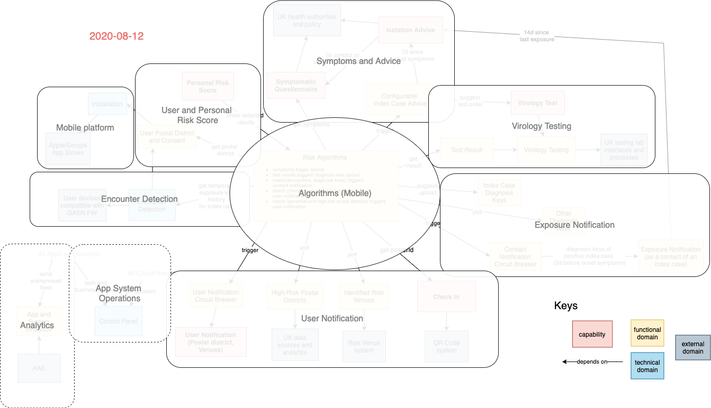
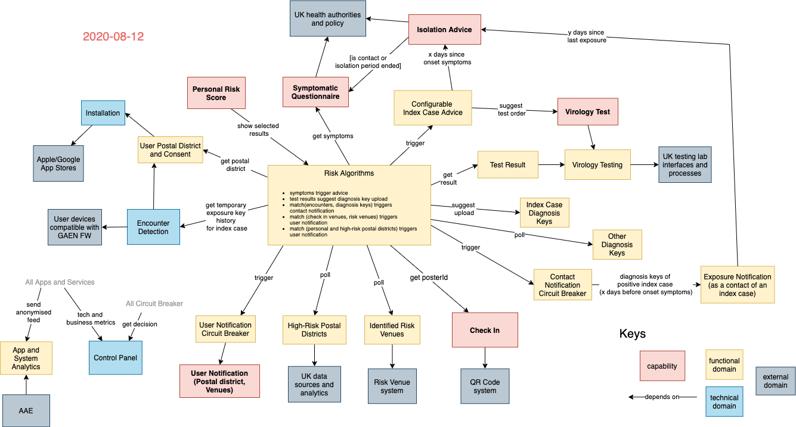
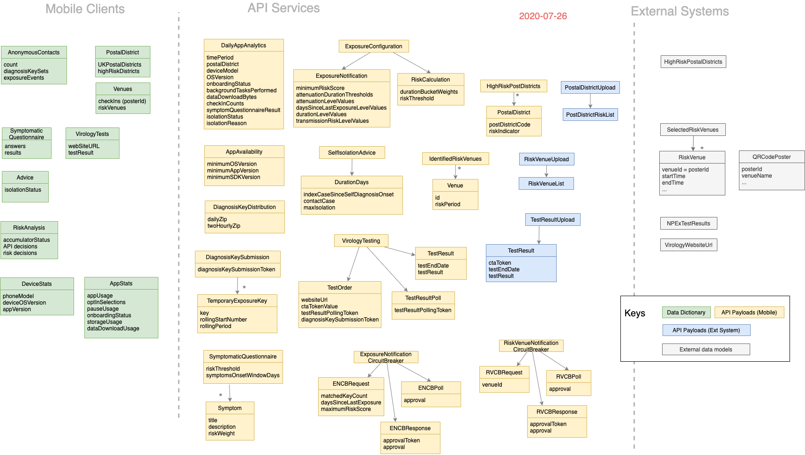
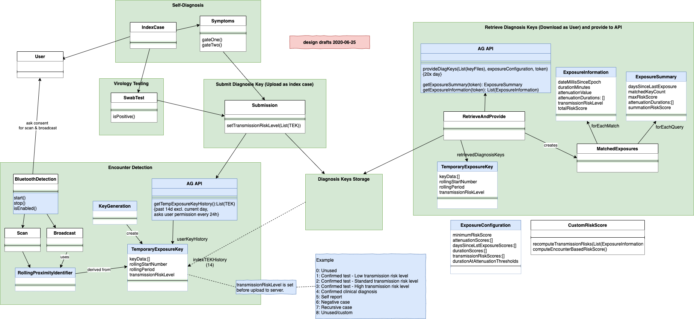
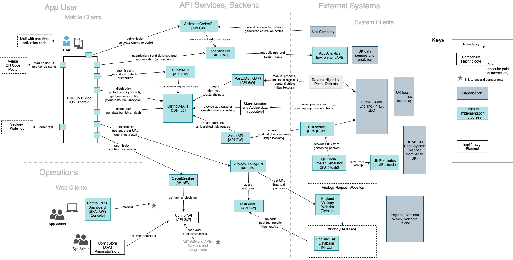
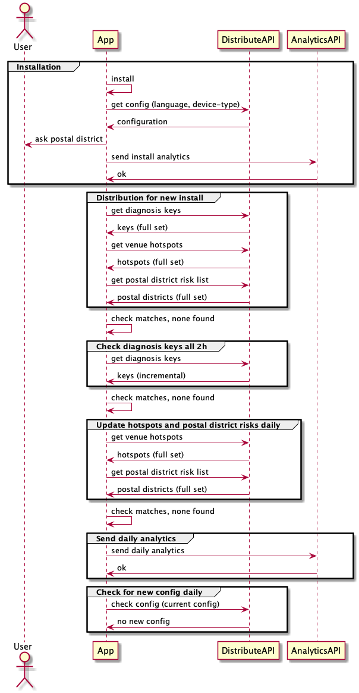
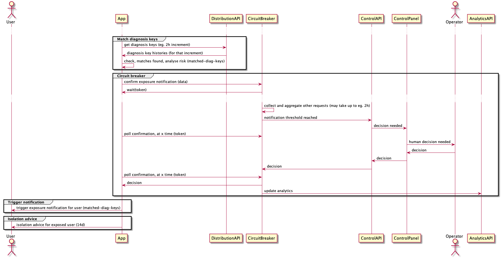
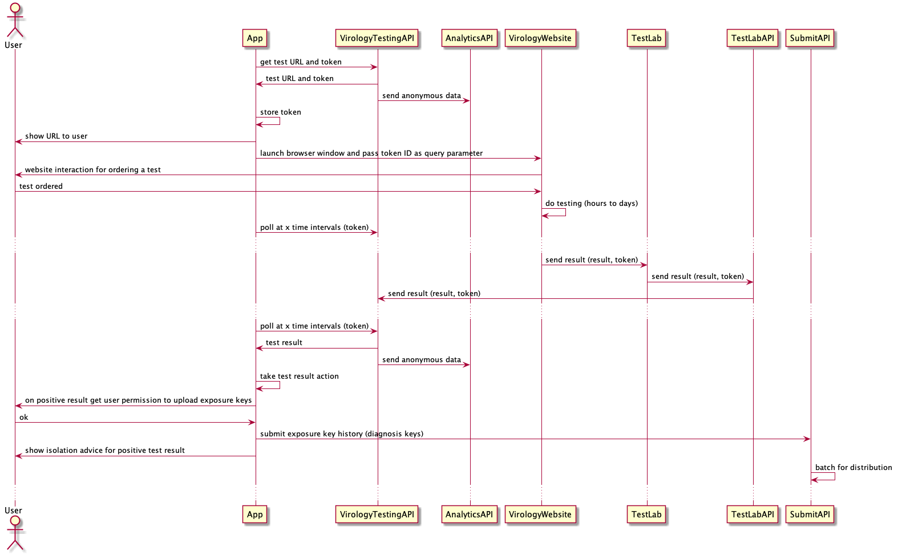
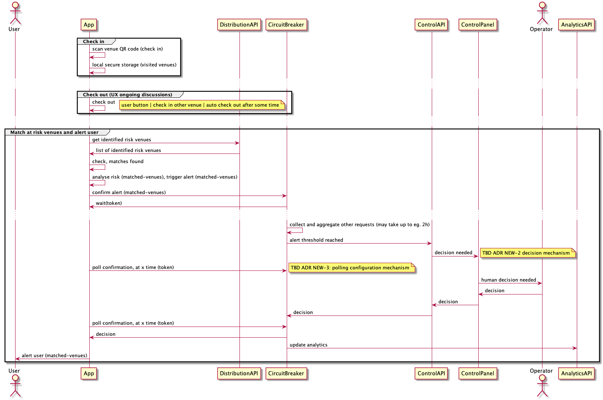

# NHS CV-19 App System | Architecture Guidebook

**2020-08-12** 

This is a living guidebook and unique point of architectural reference for the NHS Test and Trace Application

## Table of Contents

Architecture

* [Context and Driver](#context-and-driver)
* [Domain Model](#domain-model)
* [Architecture V3](#system-architecture) and [Flows](#system-flows)
* [API Service Architecture](#api-service-architecture), [iOS App](#iOS), [Android App](#Android)
* [Infrastructure](#infrastructure)
* [Quality Attribute Scenarios](#quality-attribute-scenarios)
* [Architecture Decisions](#architecture-decision-log)

Appendices

* [API Contracts](#api-specifications)
* [Conceptual System Flows](#flow-specifications)

## Context and Driver

### Vision

The Test and Trace Application is about speed, precision and reach in context of the overall Test & Trace program. It triggers isolation advice in minutes, provides measurements of time and approximated distance and notifies who you met, while protecting your privacy.

There are six capabilities to implement that vision

  1. **Symptom checker**: records symptoms, suggests a test and triggers isolation
  1. **Test odering**: order a test and receive test results
  1. **Personal risk score**: encounter history, behavioural risk
  1. **Self-isolation advice**: countdown timer, triggered by symptoms and by exposure notification
  1. **Postcode risk notification**: matches personal postcode prefix with given CV-19 high-risk postal districts
  1. **Venue check-in**: scanning at entry, user notification after match against given list of risk venues

## Domain Model

### Domains Overview

The CV19 App System is a composition of different functional, technical and organisational domains, related to each other by different app user journies:

1. Mobile platform
1. User and personal risk score
1. Encounter detection
1. Symptoms and advice
1. Virology testing
1. Exposure notification
1. User notification
1. Algorithms
1. App system operations
1. Analytics

### Functional and technical domains

Note that our concepts include terminology of the GAEN framework [see Android API doc, Glossary](https://static.googleusercontent.com/media/www.google.com/en//covid19/exposurenotifications/pdfs/Android-Exposure-Notification-API-documentation-v1.3.2.pdf).

* **Encounter detection** provides temporary exposure key histories for index cases; we probably use attenuation duration only (and not the AG risk scoring)
* **Diagnosis keys** are polled periodically from the backend and then matched on mobile client side using the AG-API (provide diagnosis keys, and get exposure information and summary)
* **Personal risk score** as a user-centric risk visualisation of one or several results of the risk analysis
* **Risk indicators** are: Self-diagnosis, Test results, Exposure notification, Identified risk venues and High-risk postcodes
* **Symptoms** trigger isolation advice, but **not** a diagnosis key upload
* **Isolation advice** offers **ordering a test**
* Based on **test result**, diagnosis key upload with exposure notification and/or index case advice is (re)triggered
* Venue **QR codes** are polled and matched with codes collected by **Check In**
* **High risk postcodes** are polled and matched with postcode prefix
* **User Notifications** can be triggered by different risk indicators, for the particular user
* The important **difference between user and exposure notification** is that the latter always and only refers to diagnosis key matches for the contacts of an index case (cascading). User notifications in contrast are triggered only by and for user owned data like postcodes, QR codes or social distancing behaviour.
* **System analytics** is the one and only domain getting anonymised user related data. Design and implementation needs to address in particular privacy and security concerns.
* **Control panel**: to monitor apps and system. It is linked with all circuit breakers and enables human decision-making to confirm massive scale risk actions.

### External domains

* Encounter detection depends on the user devices with their iOS and Android OS and their implementation of the AG Exposure Notification Framework.
* Symptoms, Index case advice and the Personal isolation companion depend on approved policies and data from UK health authorities.
* Virology testing depends on UK testing labs with their specific organisation, processes and technical interfaces.
* Import of hot spot venue QR codes depends on a 3rd party system which implemented a QR code solution for checking in at venues.
* Import of high risk postcodes depends on corresponding CV19 related data sources.

### Data Model

The following data model provides a black box view on the system's data model. It uses the data specifications of our Data Dictionary and Payload specifications of our API contracts.

### AG-API details

This is a conceptual analysis on the usage possibilities of the AG-API. It has been used for the architectural design of our usage of the AG-API. For data model details please see the latest [GAEN API documentation](https://www.google.com/covid19/exposurenotifications/)

## System Architecture

The NHS CV19 system architecture has three parts, mobile app, cloud backend and external systems. It adheres to following principles

1. No User State or Identifier is stored on the Cloud Services
1. All APIs are stateless where possible
1. When stateful behaviour is required, short-lived tokens are used as identifiers. As described in the flow below this exist only as long as are needed
1. Some interactions are in place to support future functionality
1. Rich analytics are collected, completely anonymously. A user’s IP addresses will not be recorded. Some identifiers such as phone device type will not be aggregated at a postal district level.

The diagrams show the component's name (responsibility), technology and their internal and external dependencies.

* Android and iOS native mobile apps implement the user-centric vision of the Test and Trace application. We use the AG-API to implement encounter detection based on BLE attenuation duration.
* Backend services are implemented using an AWS cloud-native serverless architecture and provided to mobile clients as APIs. For the implementation of the services we use AWS Lambdas.
* The integration of external systems is implemented in the backend, using required APIs (think of consumer-driven contracts) for the external systems and provided APIs for the mobile clients.
* Web clients for smaller mostly internal user groups are implemented as SPAs (single page applications), predominantly React, to be hosted on S3.

* Security and operations is built on AWS cloud-native components (detailed below)

## System Flows

System flows describe the interactions between the app, the backend services, the Control Panel website and 3rd part systems like Virology testing. The related sequence diagrams can be found in the Appendix of this guidebook.

The details of the APIs that participate in these flows and the services that support them are developed as we move forward with implementation.

### Installation and normal use

This is the [flow on first app install, and in normal use](#system-flow-installation-and-normal-use) when it is collecting exposures and QR code check-ins and checking these against distributed positive diagnosis keys, HotSpot QRs (Venues) and high-risk postcodes.

The app is expected to have the following **configuration**:

* AG EN API Config (Apple Google Exposure Notification)
* Risk Analysis Controls
* Feature Controls & Kill Switch
* Symptomatic Questionnaire Contents (likely predefined answers and values)
* Display text that is likely to change
* URL links for backend services, and possibly for advice and Swab Testing
* Notifications to be shown to the users of the app

Some of this configuration may be dependent on the language in use on the phone and its device type. For the first version its likely that all requests get the same config returned. Configuration will be signed to confirm authenticity. Multiple configuration will need to be fully tested, not just the expected initial configuration.

For first install the app will submit the following **analytics**

* Postal District
* Device Type (Manufacturer and model)

Each day the app will submit as appropriate and completely anonymously, data as listed by Daily App Analytics in the data model above.

Should **distribution of the Diagnosis Keys** and the HotSpot QR codes be separate calls or bundled as one? If its a single call/package that would limit the requests going to the server and save a small bit of bandwidth due to less headers. If they're separate, we could choose to download them at a different frequency.

The AG-API puts constraints on how frequently we can check for the user's diagnosis keys, but that doesn’t apply to the QR codes. Checking for updated QR hotspots could be done daily, or could be done whenever checking for diagnosis keys.

Scenario [SCN012](./scenarios/SCN012-num-users-distribution-service.md) discusses different assumptions on number of users and impact the distribution architecture.

For the first release it is expected that the **Postal District risk** will be a lookup using the partial Post Code submitted by the User. It is expected that we will host the list within our system. In the future it might be a set of risks for a scrollable map, so that someone can assess the risk of other destinations also.

The "Geiger" feature is currently also described as Personal Risk Model and it is not yet decided what a sensible input to the counter would be. As long as the existing risk analysis results are used, the following holds:

* One or several of the risk analysis results are used to derive a personal risk score low, high or no risk.
* Since all risk analysis is computed mobile client-side, no backend interaction but the daily analytics update with the computation result is needed

### Matching diagnosis keys trigger exposure notification

This is the [flow when a diagnosis key match is found](#system-flow-matching-diagnosis-keys-trigger-exposure-notification). A ‘Circuit Breaker’ is a backend service to control alert or notification decisions, so a scenario where a whole city is told to isolate can be identified and action taken before it occurs. This Circuit Breaker is not expected to be fully functional in the F&F release and might always return true. However, it is mandatory for later nation wide releases.

The timing of when the match checks are made within the app is driven by the requirements of the AG-API.

The **risk analysis** is performed by a collection of algorithms within the app, using all available data and the risk analysis configuration retrieved from the backend. There is no personal data in the backend that are needed as part of the risk analysis.

If  risk analysis results in an action trigger, this must be **confirmed with the Circuit Breaker** backend service. The API may need time to decide what action to take (as it needs to see what other app user actions are pending, and get human input) hence it never makes an immediate response. Rather it generates a short-lived token and returns this reference to the app for it to ask for updates.

Not expected to be in the first release. This is the logic that decides whether to allow the action to proceed or not. The app will periodically poll the server for a decision, driven by the backgrounding schedule of the app. For the first release it is expected that all actions will be allowed to proceed.

**Open questions.** When considering a set of commuters travelling from Reading to London yet they catch Covid-19 due to proximity events in London, does the circuit breaker affect London or Reading?

It is likely a good idea that anyone that we ask to isolate is asked to provide their Exposure Diagnosis keys, in case we need to do secondary cascades in the future.

For the Isolation State please note, that no user state is stored within the cloud services. When we have asked a user to take an action all record of this must be held on the app.

As long as **we do not ask for uploading diagnosis keys on symptoms**, there is no specific app-backend interaction for this flow. We assume

* App has the latest symptoms configuration
* Configuration includes a mapping from symptoms to advice
* App has all advices available

Then the user enters symptoms, the app maps them to an advice, which is then shown to the user. With the advice there is an option to order a test and a start of the isolation countdown. The countdown is not synchronised with the backend, as long as there is no explicit requirement to eg. be able to recover from app or mobile OS failures.

### Request virology testing and get result using a temporary token

This is the [flow that is taken when the app recommends to a user that they take a Virology test](#system-flow-request-virology-testing-and-get-result-using-a-temporary-token). This process involves ordering and registering tests through a Virology Testing website, the detail of which is covered elsewhere. Note the flow step for actual Virology Testing is a horribly over-simplified view of a complex process, search Virology Integrations on Confluence for more details.

The Circuit Breaker API is not asked to confirm any decisions in this flow. This step could be added in case it is needed in the future, however a confirmed test positive is unlikely to require additional control like alerts and notifications do.

A **(temporay) token id** is needed, unique for the app system, that is passed in to the Virology Testing system and comes back in the test results to identify a particular result. It only lives as long as the Virology Test is in flight. This implies that if there's a set of bad test results identified, there's no way to change the result.

The mechanism by which the app determines the need for a test is not specified here. This flow starts once the app has decided to recommend a test.

The app needs a **token to pass to the Virology Testing website** so that it can match the results that come back a few days later. This token must be generated as unique by the Backend Service. It is expected that the Backend service will store the token so that it can confirm the results that it is sent are valid, and for in the future if it can maintain updates from Virology Testing for a particular test in flight.  

Given that the app needs to go to the backend to get the code, it seems sensible to get the URLs for the Virology website at this point also, to ensure the latest correct site is used. This could also be used in the future for load balancing Virology Testing requests across different providers.

In the **current implementation the Test Lab is NPEx** and results are sent to our backend services a few times a day in batches, in a CSV file.

The app will sporadically poll the backend Services to see if the test result is available.

If the test result is negative no further action is taken.

As per the flow for an Exposure Notification, when an app user is confirmed positive they are asked to **submit their keys for inclusion in the distribution** set. It’s possible that this step may need to happen at the start of the flow, when the App decides that a test is needed.

Changed symptoms may have an effect on isolation advice and companion:

* If the 7d isolation advice ends, the user is asked again for symptoms
* With the 14d isolation advice, the user is asked for symptoms while having received the isolation advice already
* Since we assume that the periodical data polling and downloads continues during isolation, the symptoms configuration and advice should be up-to-date
* Dependening on the symptoms the advice may change, but is still without additional backend interaction

### Check in and out, matching hotspot venues and alert user

The [venue check in system flow](#system-flow-check-in-and-out-matching-at-risk-venues-and-alert-user) imports data from an external system, matches and then triggers an alert for the interacting user.

There are some important points in this flow:

* Distribution behaviour needs to be configurable
* Poll config mechanism needed, we don't want to receive poll storms

## API Service Architecture

The CV19 App System's provided API services group into a smaller number of fundamental concepts and architectural patterns:

* Submission & query
* Distribution to mobile apps
* Web site links (Virology Testing)
* Third party file upload
* Circuit breaker
* Control panel
* Application level security

### Tech Stack

The API services are implemented using the following tech stack

* Run: AWS and Java
* Build and Deploy: Ruby and Terraform
* Test: Robot Framework (Python)

The AWS cloud-native implementation uses API gateways acting as a facade for serverless functions with mostly S3 buckets for storage. The services are configured using Terraform source code files. Payloads are signed using KMS. Some patterns require more DB like persistence where we use DynamoDB. Finally some services and storage components require time triggers or time related functions and AWS features such as retention policies for S3 buckets.

## Mobile App Architecture

### iOS

The iOS app only uses standard Apple tooling, all bundled within Xcode.

* [Application source code](https://github.com/nhsx/covid-19-app-ios-ag-public)
* [Architecture and module definitions](https://github.com/nhsx/covid-19-app-ios-ag-public/blob/master/Docs/AppArchitecture.md)
* [Internal and external dependencies](https://github.com/nhsx/covid-19-app-ios-ag-public#dependencies)

### Android

The Android app uses standard Android tooling, Kotlin and Android SDK. The build uses Gradle with a couple of third party Gradle plugins for publishing and protobuf (only for field test).

* [Application source code](https://github.com/nhsx/covid-19-app-android-ag-public)
* [Internal and external dependencies](https://github.com/nhsx/covid-19-app-android-ag-public/blob/master/app/build.gradle)

## Web Architecture

**Tech Stack** React SPA hosted on S3, delivered by CDN.

The closed beta release does not provide any public available web client, so we add to this section as soon as there is a web client beyond what we use as internal tools.

## Infrastructure

The CV19 App System infrastructure and operations uses AWS cloud-native components like Route53, AWS CDN, API Gateways, Lambdas and S3. The infrastructure components implement support for

* Mobile app integration
* API services
* Third party system integration
* Operations
* CDOC integration

## Deployment

Our build system and deployment architecture is currently used only internally. We add documentation to this section as soon as these internal components for development and delivery becomes relevant for public development.

## Quality Attribute Scenarios

Quality scenarios provide support for architectural decisions making and advanced continuous testing of system qualities as part of our CI/CD pipelines. For the closed beta release, the system was tested following industry best practices like automated unit, integration and system tests as well as external load and pen testing.

For future releases we evolve our approach to include system quality testing related not only to security and performance but to any other *ility as outlined by our [current scenarios](scenarios/).

## Architecture Decision Log

We use [Architectural Decision Records ADRs](decisions/) to track decisions in github as part of the architecture documentation.

## Appendices

### API Contracts

* [API Patterns](../api-patterns.md)
* [API Contracts](../design/api-contracts)

### Flow Specifications

#### System Flow: Installation and normal use

#### System Flow: Matching diagnosis keys trigger exposure notification

#### System Flow: Request virology testing and get result using a temporary token

#### System Flow: Check in and out, matching at risk venues and alert user

