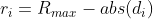
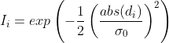
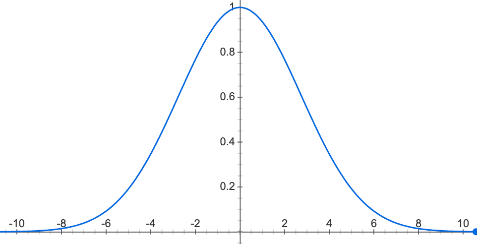
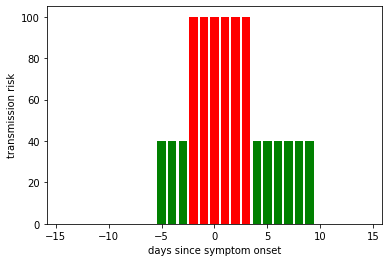

### GAEN Framework
Background and an explanation of the framework's basic functionality can be found [here](https://blog.google/documents/73/Exposure_Notification_-_FAQ_v1.1.pdf)

The app launched using the Google and Apple Exposure Notification (GAEN) API version 1 (known as version 1.4 on Android) and, as of release v3.9,
the app has been updated to support version 2 (version 1.6+ on Android). iOS 13.5 and 13.6 don't currently support version 2 of the GAEN API and hence we have to support
both versions in production.

#### Core behaviour
At their core, both versions of the API function the same way and the basic flow is simple. When a user receives a positive
test result they are prompted to share their keys with the central server. These keys are then bundled into key files and at
regular intervals other users apps will download these key bundles and compare the contained keys with the keys they've interacted
with in the last 14 days. In the event that the downloaded key bundle contains one or more keys that have previously been
received by the API then the app calculates a risk score for the encounter with the key. If this risk score exceeds a certain
threshold then it will advise the user to self isolate and order a test.

#### GAEN API version 1/1.4
This is the original version of the GAEN API and is the version that was used by the app at initial launch. Many of the
methods and objects associated with v1 are now marked as deprecated, and we have moved to v2 in v3.9 of the app, however we still
use the v1 methods as a [fallback on iOS](#fallback-behaviour) when the v2 OS requirements are not met.

##### Downloading keys
In v1, calls to provide keys to the GAEN API are limited to 20 per day. In the initially released version of the app which uses v1,
the app schedules a background task to run every 2 hours to download any new bundles of keys and provide them to the GAEN API.

> NOTE: This background task behaviour is specific to versions < 3.9 of the NHS COVID-19 app, and not v1 of the GAEN API.

The API then checks if any of the newly downloaded keys match with the keys the device has encountered and stored locally. If there is
a match, we then request further information about the encounter.

In v1, we use the [`ExposureInformation`](https://developers.google.com/android/exposure-notifications/exposure-notifications-api#exposureinformation)
object to receive further details about a particular encounter which we can then use to calculate a risk score. Calling the method to
[get `ExposureInformation`](https://developers.google.com/android/exposure-notifications/exposure-notifications-api#getexposureinformation)
causes the GAEN API to display a notification to the user alerting them of a possible exposure. The app then uses the calculated
risk score to determine whether the encounter is risky.

##### Risk scoring
The [config](../../src/static/exposure-configuration.json) provides values `attenuationDurationThresholds`
to the GAEN API to denote the BLE 'attenuation buckets' edges. For a given encounter, the corresponding `ExposureInformation`
details the amount of time spent in the three attenuation buckets - 'near', 'medium', and 'far'. The config also defines
a weight for each of these buckets and thus the risk score can be calculated by multiplying the sum of the weighted attenuation
bucket durations with the infectiousness factor.

##### Infectiousness via `transmissionRiskLevel`
The infectiousness of an individual is higher the closer they are to their onset of symptoms. The app makes use of the
`transmissionRiskLevel` field to encode information about the infectiousness level of the individual which is used to
calculate the aforementioned infectiousness factor of the risk score calculation.

When the app uploads keys (due to a positive test result) we augment the key with the `transmissionRiskLevel` field, which
we set to reflect the days between the day the key was in use and when symptoms started. However, the field is limited by
the API to only accept values in the range 0-7 so we can't just set the difference in days. For a given key i,
where the maximum risk level Rmax=7 and di is the number of days since onset of symptoms that key i was created,
transmission risk level ri is calculated as follows:

We can then use this value on receipt of a key to calculate an infectiousness factor using an equation derived from equation
3 in [Risk scoring for the current NHSx contact tracing app](https://arxiv.org/pdf/2005.11057.pdf).

Because we cannot send negative values, we choose to remove μ0 and thus the curve is symmetrical and centred around 0.
So, with abs(di)=Rmax - ri, σ0=2.75 the formula for infectiousness factor (Ii) on encounter with key i is:

The curve for which looks like this

#### GAEN API version 2/1.6+
Version 2 of the API functions much the same as version 1, but when evaluating the risk associated with a contact the API
provides time series data (known as `ScanInstance`s) for the duration of the contact (know as an `ExposureWindow`).

A more detailed breakdown on the data structures available from the v2 API can be found in the [GAEN documentation](https://developers.google.com/android/exposure-notifications/exposure-notifications-api#data-structures).

##### Downloading keys
In version 2 of the GAEN API keys can only be provided to the API to check for contacts 6 times per day, this is a significant
reduction from the 20 times per day limit that existed for version 1, but it does also come with the ability to pass in
multiple keys files as part of 1 call.

This is an improvement over version 1 in terms of initial setup, as it means that when the app is freshly installed, you are
able to 'catch up' on the past 14 days of key files in one call to the API, rather than making calls till you hit the rate limit.
However, because older builds of the app expect to pull down a new key file every 2 hours, key bundles are created at the same
rate and if the version 2 compatible app tried to consume files at this rate, it would hit the rate limit early on each day.

To deal with this limitation the app downloads key files at most, once every 4 hours. When the app moves to download files
it pulls down all key files between the last downloaded file and now and supplies all of them to the API in one call.

##### Risk scoring
The time series data provided by the v2 GAEN API allows us to use a more sophisticated algorithm for risk scoring than the one used in v1.
A top-level description of this algorithm follows, whilst a more detailed explanation can be found in this [paper](https://arxiv.org/abs/2007.05057).

In version 2, a contact is (roughly) encapsulated as an `ExposureWindow`, this window contains time series data for exposure
as a number of `ScanInstance`s. Each `ScanInstance` stores information about the sighting of beacons from a diagnosis key
within a BLE scan (typically of a few seconds). A risk score is calculated for each `ExposureWindow` by feeding the `ScanInstances`
into an Unscented Kalman Smoother.

We then multiply the risk score generated from the `ExposureWindow` by an [infectiousness factor](#infectiousness) and
compare that score to a given risk threshold to decide if a contact was 'risky' or not.

##### Infectiousness
Infectiousness in v2 is less granular than our infectiousness implementation on v1, as the API provides only 3 levels of infectiousness
`NONE`, `STANDARD` and `HIGH`. Each `ExposureWindow` will have a value for infectiousness, which is worked out by setting a
mapping of the difference between the day the `ExposureWindow` was recorded and symptoms began to a level of infectiousness.
The current mapping is:

| Days since onset | Infectiousness level
|------------------|----------------------
| < -5             | `NONE`
| -5 to -3         | `STANDARD`
| -2 to 3          | `HIGH`
| 4 to 9           | `STANDARD`
| \> 9              | `NONE`

When an app uploads keys (due to a positive test result) we augment the key with a `daysSinceOnsetOfSymptoms` field which
records how many days there were between the date this key was in use, and the user began to suffer from symptoms.

It should be the app's responsibility to define a default infectiousness level for the situation where `daysSinceOnsetOfSymptons` isn't set for a key.
However, there is an existing bug in the iOS implementation of the GAEN API which means the mechanism to supply this default value does not work.
This bug is due to be fixed as part of iOS 14.2 which at the time of writing is not released. In order to deal with being unable to set a default value in app,
the system's backend attaches a default `daysSinceOnsetOfSymptoms` of 0 to keys without the field whilst building bundles for distribution.

When evaluating the risk for a contact, we convert the infectiousness level into an infectiousness factor which is used in the
risk scoring calculation (see the Risk Scoring section above). The current mapping of infectiousness level is based off the
following diagram.

And the following values are used.

| Infectiousness level | Infectiousness Factor
 |----------------------|----------------------
| `NONE`               | 0.0
| `STANDARD`           | 0.4
| `HIGH`               | 1.0

##### Cached keys
Keys that have been supplied to the API are now cached, so whenever you get a new match you also get the chance to re-evaluate
matches from the last 14 days. This means that changes to the `riskThreshold` can be applied to contacts that were originally
considered under the previous threshold, as long as they haven’t expired.

##### Fallback behaviour
On Android devices, the installed version of the GAEN API is dictated by the installed version of Google Play Services.
Devices which have a version of Play Services older than 1.6 will continue to use the v1 GAEN API.

On iOS devices, the installed version of the GAEN API is dictated by the installed version of iOS. Version 3.9 of the app,
where the v2 risk scoring methods are introduced, will fallback to v1 for risk score calculation on devices which have an iOS
version older than 13.7.

It's worth noting that if the app falls back to using version 1 of the GAEN API, it will still only download key files every
4 hours.
