# NHS CV19 App System | Architecture Guidebook

This is a living guidebook and unique point of architectural reference for the NHS Test and Trace Application

## Table of Contents

* [Context](#context)
* [Functional Architecture](#functional-architecture)
* [System Overview](#system-overview)
* [System Architecture](#system-architecture)
* [System Behaviour](#system-behaviour)
* [System APIs and Interfaces](#system-apis-and-interfaces)
* [Tech Stacks and Repositories](#tech-stacks-and-repositories)
* [Infrastructure](#infrastructure)

## Context

The Test and Trace Application is about speed, precision and reach in context of the overall Test & Trace program. It triggers isolation advice in minutes, provides measurements of time and approximated distance and notifies who you met, while protecting your privacy.

* Trace: Get alerted if you’ve been near other app users who have tested positive for coronavirus.
* Alert: Lets you know the level of coronavirus risk in your postcode district.
* Check-in: Get alerted if you have visited a venue where you may have come into contact with coronavirus.
* Symptoms: Check if you have coronavirus symptoms and see if you need to order a free test.
* Test: Helps you book a test and get your result quickly.
* Isolate: Keep track of your self-isolation countdown and access relevant advice.

## Functional Architecture

The CV19 App System is a composition of different functional, technical and organisational domains, related to each other by different app user journeys, from left to right, clock-wise:

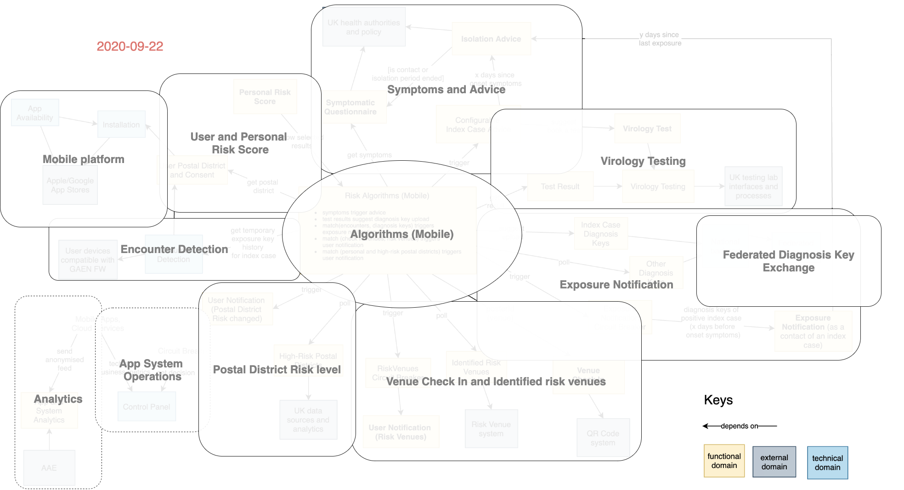

### Functional and technical domains

Our concepts include terminology of the GAEN framework. Please see the [GAEN API](https://static.googleusercontent.com/media/www.google.com/en//covid19/exposurenotifications/pdfs/Android-Exposure-Notification-API-documentation-v1.3.2.pdf) for detailed data models and concept definitions.

* **Encounter detection** provides temporary exposure key histories for index cases; we probably use attenuation duration only (and not the AG risk scoring)
* **Diagnosis keys** are polled periodically from the backend and then matched on mobile client side using the AG-API (provide diagnosis keys, and get exposure information and summary)
* **Personal risk score** as a user-centric risk visualisation of one or several results of the risk analysis
* Risk indicators for analysis: Self-diagnosis, Test results, Exposure notification, Identified risk venues and High-risk postcodes
* **Symptoms** trigger isolation advice, but **not** a diagnosis key upload
* **Isolation advice** offers **ordering a test**
* Based on **test result**, diagnosis key upload with exposure notification and/or index case advice is (re)triggered
* Lists of venues identified by public health organisations as risk venues are polled and matched with information from Venue QR codes scanned by the app's **Venue Check In**.
* **High risk postcodes** are polled and matched with postcode prefix
* **User Notifications** can be triggered by different risk indicators, for the particular user
* The important **difference between user and exposure notification** is that the latter always and only refers to diagnosis key matches for the contacts of an index case (cascading). User notifications in contrast are triggered only by and for user owned data like postcodes, QR codes or social distancing behaviour.
* **System analytics** is the one and only domain getting anonymised user related data. Design and implementation needs to address in particular privacy and security concerns.
* **Control panel**: to monitor apps and system. It is linked with the circuit breakers and enables human decision-making to confirm massive scale risk actions.

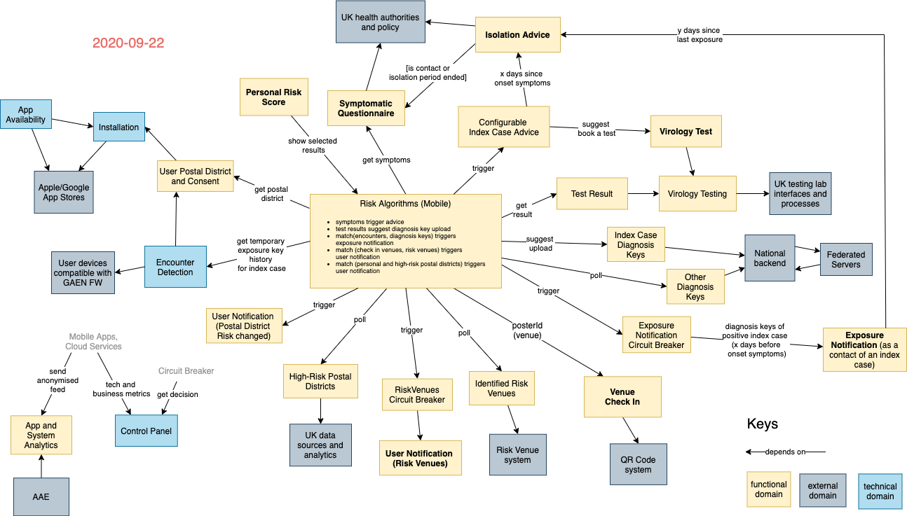

### External domains

* Encounter detection depends on the user devices with their iOS and Android OS and their implementation of the AG Exposure Notification Framework.
* Symptoms, Index case advice and the Personal isolation companion depend on approved policies and data from UK health authorities.
* Virology testing depends on UK testing labs with their specific organisation, processes and technical interfaces.
* Import of hot spot venue QR codes depends on a 3rd party system which implemented a QR code solution for checking in at venues.
* Import of high risk postcodes depends on corresponding CV19 related data sources.

### Data Model

The following data model provides a black box view on the system's data model. It uses the data specifications of our Data Dictionary and Payload specifications of our API contracts.

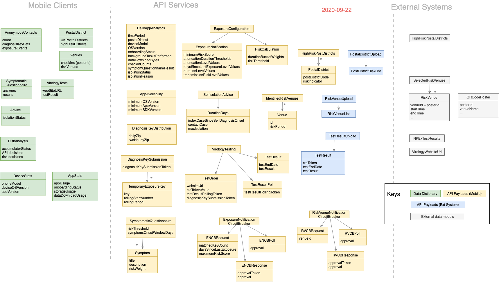

### GAEN Framework

This is a conceptual analysis on the usage possibilities of the GAEN Framework and API. It has been used for the initial architectural design of our encounter detetction and exposure notification. For data model details please see the latest [GAEN API documentation](https://developers.google.com/android/exposure-notifications/exposure-notifications-api#glossary)

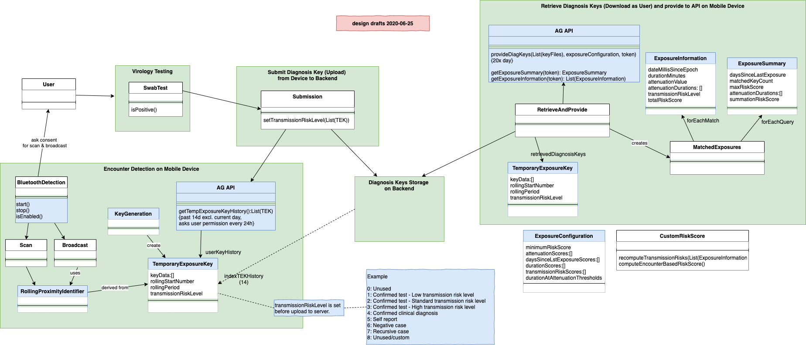

## System Overview

The NHS CV19 system architecture has four major parts, mobile app, cloud backend with API services, external systems and operations.

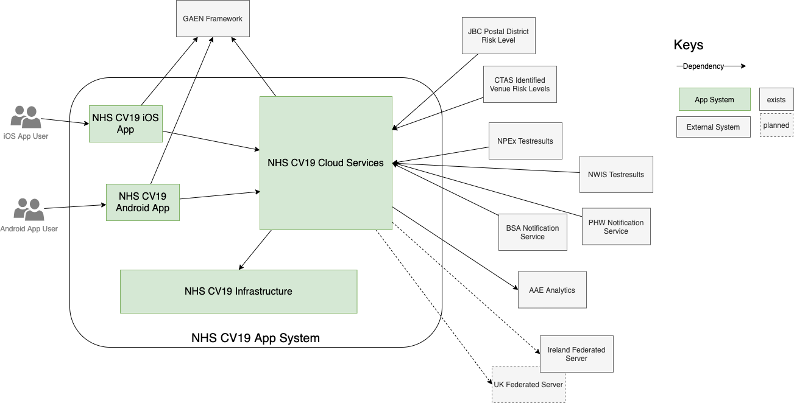

It adheres to following principles

1. No User State or Identifier is stored on the Cloud Services
1. All APIs are stateless where possible
1. When stateful behaviour is required, short-lived tokens are used as identifiers. They exist only as long as they are needed
1. Mobile analytics are collected, completely anonymously. A user’s IP addresses will not be stored by the functional App System
1. External system integration follows an API-first approach

Note, that on the technical layer HTTPS is used, where Internet Network Providers typically transfer IP-addresses between technical endpoints such as mobile device and the Web Application Firewalls of the AWS cloud services. However, we do not store any of these in the App System's backend.

## System Architecture

The system architecture diagram below specifies the complete system showing the main system components with their communication ports, and integrations within each other:

* Android and iOS native mobile apps implement the user-centric vision of the Test and Trace application. We use the EN Framework provided by Apple and Google to implement encounter detection based on BLE attenuation duration.
* APIs and Cloud Services (Backend) are implemented using an AWS cloud-native serverless architecture and provided to mobile clients as APIs. For the implementation of the services we use AWS Lambdas.
* The integration of external systems is implemented by the backend, again following an API-driven approach for all provided interfaces. For exporting or providing data there are connector or exporter implementations, again using AWS Lambdas.
* As part of Operations, web clients for smaller internal user groups and stakeholders are implemented as SPAs (single page applications), predominantly React, which could be hosted on S3.
* Security and operations is built on AWS cloud-native components.

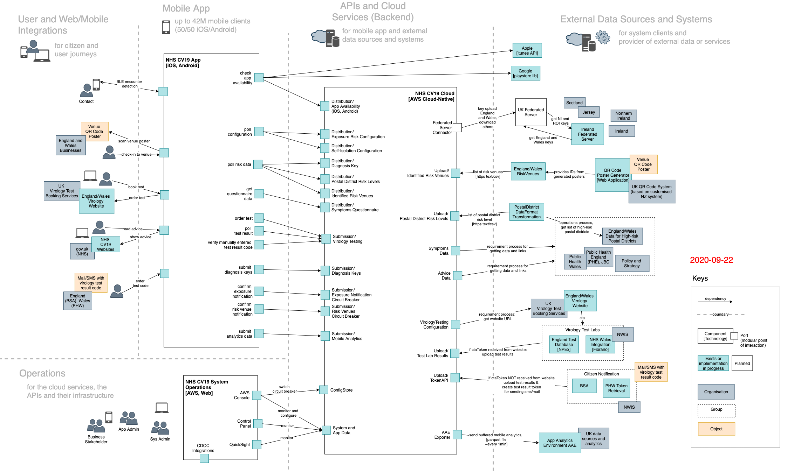

The port names in the system architecture are usually defined by ```API Group\API Name```, e.g. ```Submission\Diagnosis Key```.

## System Behaviour

System flows describe the behavioural interactions between the app, the backend services, the external systems and the monitoring and operation components. They **do not describe interactions within a single system component** like an app user interacting with only mobile app.

### Installation, configuration and normal use

This is the flow on first app install, and in normal use when the app is collecting exposures and QR code check-ins and checking these against distributed positive diagnosis keys, identified risk venues and high-risk postcodes.

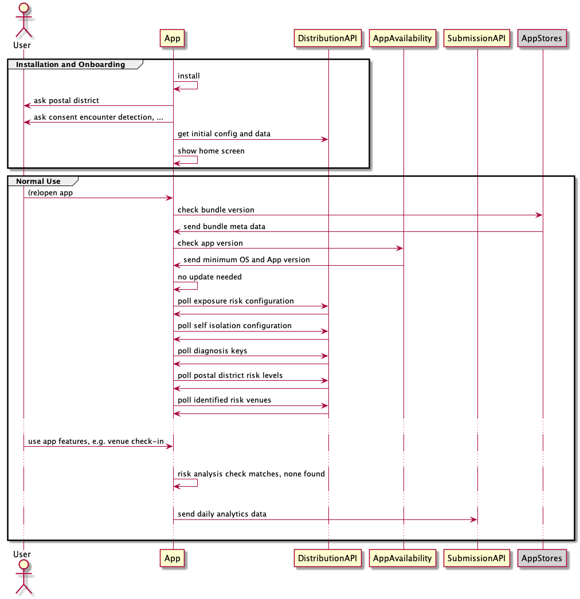

On **first install and when the app is opened** after it has been closed completely on the mobile device, it checks version availability with our backend service as well as the Apple and Google app stores. This check then may notify the user of mandatory or optional available app updates. It also allows to deactivate all but the availability check functionality, hence acting as a kind of "kill switch".

After that it downloads and applies the following **configurations**:

* Exposure Configuration (Apple Google EN Framework) for encounter detection and exposure risk computation
* Self-Isolation Configuration for isolation time intervals

It then periodically downloads and uses data, retrieved from  **data distribution** APIs:

* Diagnosis Keys
* Postal District Risk Levels
* Identified Risk Venues
* Data and structure for the Symptoms Questionnaire

On a daily basis the app will submit anonymous **mobile analytics** data:

* Technical static data: OS and app version, and the device model
* Technical dynamic data such as cumulative bytes of data uploaded/downloaded and the number of completed background tasks
* App usage related data on
  * Onboarding
  * Venue Check-Ins
  * Symptoms Questionnaire
  * Test results
  * Isolation

The analytics data is stored in the backend without any reference to the submitting device or app installation.

### Matching diagnosis keys trigger exposure notification

This is the flow when a diagnosis key match is found. A ‘Circuit Breaker’ is a backend service to control alert or notification decisions, so a scenario where a whole city is told to isolate can be identified and action taken before it occurs. 

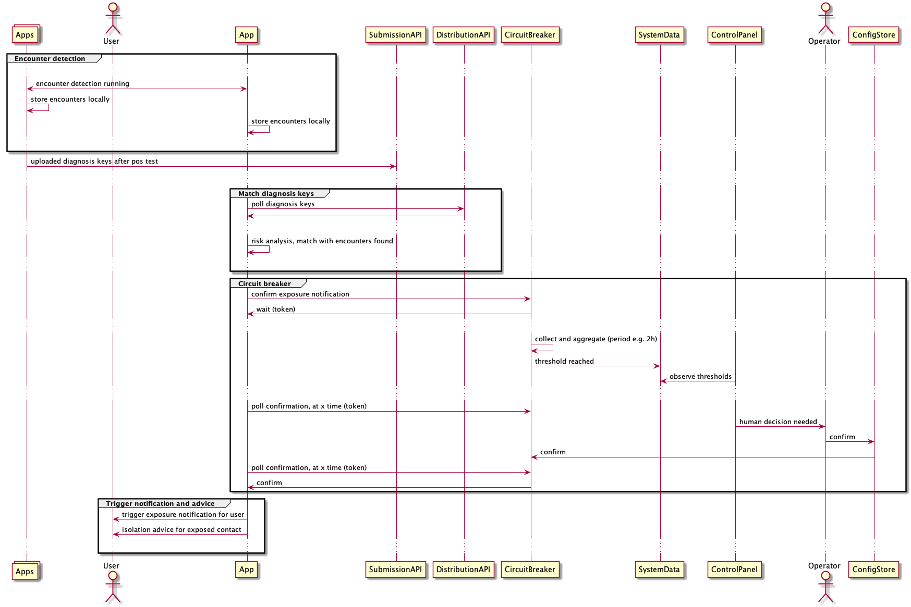

The **risk analysis** is performed by a collection of algorithms within the app, using all available data and the configuration retrieved from the backend. There is no personal data in the backend that are needed as part of the risk analysis.

If risk analysis results in an action trigger, this must be **confirmed with the Circuit Breaker** backend service. The API may need time to decide what action to take (as it needs to see what other app user actions are pending, and get human input) hence it never makes an immediate response. Rather it generates a short-lived token and returns this reference to the app for it to ask for updates. The app will periodically poll the server for a decision, driven by the backgrounding schedule of the app.

For the Isolation advice please note, that no identifiable user state is stored within the cloud services. When we have asked a user to take an action all record of this is held on the app.

### Symptoms questionnaire, booking a test and getting result using a temporary token

This is the flow that is taken when the app recommends to a user that they take a Virology test after having entered symptoms in the questionnaire.

Wenn the user interacts with the symptoms questionnaire, the App has the latest symptoms configuration and a mapping from symptoms to advice which is then shown to the user. With the advice there is an option to order a test and a start of the isolation countdown. The countdown is not synchronised with the backend, so in case the device is wiped or lost, thre is no means to recover the isolation state for that user.

The testing process involves ordering and registering tests through the UK  Virology Testing website, which is external to the App system. Note the flow step for actual Virology Testing is a horribly over-simplified view of a complex process outside of our system.

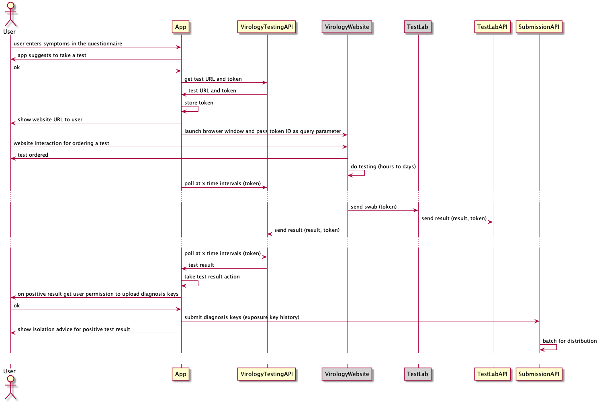

The app generates a short-lived **token to pass to the Virology Testing website** so that it can match the results that come back a few days later. This token is generated as unique by the Backend Service. The Backend service will store the token so that it can confirm the results that it is sent are valid.  

The app will sporadically poll the Virology Testing API to see if the test result is available. If the test result is negative no further action is taken.

As per the flow for an Exposure Notification, when an app user is confirmed positive they are asked to submit their keys for inclusion in the diagnosis keys distribution set.

### Receive test result token via Mail or SMS and enter into app for diagnosis key submission

This is the flow where the App user manually enters a test result code, received via SMS or Mail from the citizen notification service: BSA for England and PHW for Wales. 

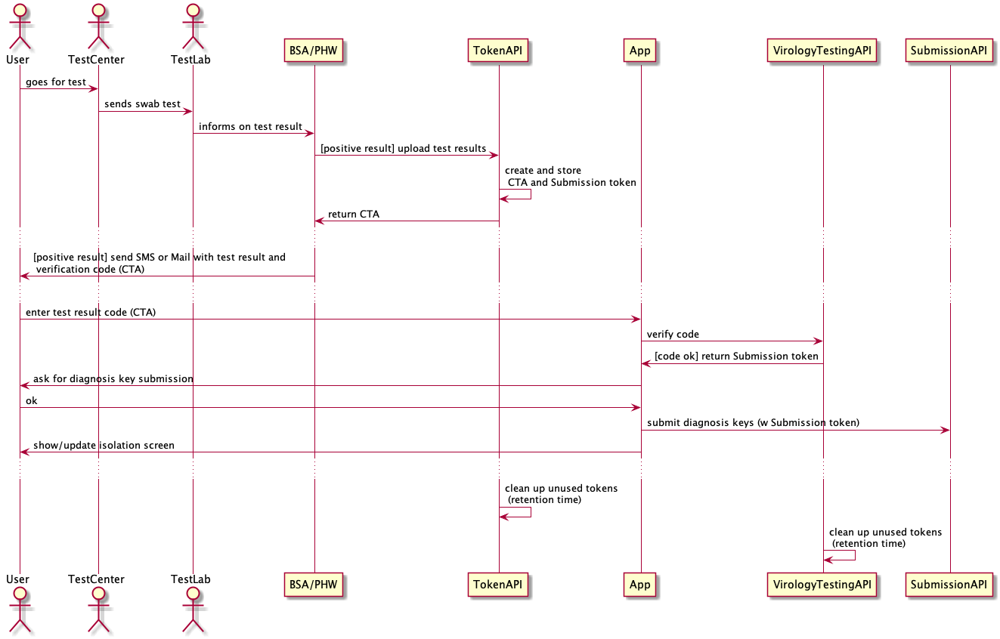

The notification service uses an App System API to upload the test result **and** get a test result verification token. The token is then send via SMS/Mail to the citizen together with the result so she can verify the test result with the app and submit diagnosis keys for contact exposure notifications.

### Venue check in, matching identifed risk venues and alert user

The venue check-in flow shows how idenitfied risk venues are imported from external systems, matched in the App against visited venues and then may trigger a corresponding notification for the App user.  


## System APIs and Interfaces

The ports of the Cloud Services component in the system architecture are implemented by API services and Interfaces, grouped into a smaller number of fundamental concepts and architectural patterns:

* Mobile **data submission** to backend
* **Distribution of data and configuration** to mobile apps
* **Circuit breaker** for specific app user notifications
* **External systems data** by file upload to backend
* **Connectors and exporters** to external systems
* **Dashboards** for monitoring
* Application level **security**

The following solution patterns take characteristics of these groups into account. The patterns are applied in [specific API contracts](./api-contracts), provided by the cloud services backend and consumed by mobile or external systems. We use an API specification by example approach based on semi-formal .md files.

All APIs adhere to the following **structure and foundational features**

* Basic endpoint schema: ```https://<FQDN>/<api-group>```
* `FQDN`: Hostname is different per environment. It is prefixed by the API group, e.g. for `submission-` you'll get ```https://submission-<host>/<api-group>```
* We provide API endpoints in different environments from test to prod, to support joint integration testing
* APIs have rate limits, see general information on [AWS API GW rate limits](https://docs.aws.amazon.com/apigateway/latest/developerguide/api-gateway-request-throttling.html)

**Security for external system access** via Upload or Submission: 

* Cloudfront presents SSL certificate with our host name in it, pinned on the root certificate(s) of the chain for our mobile app
* TLS 1.2 (tls1.2_2018 policy) is used for connection encryption
* Authorisation with API Key specially issued for each API: ```Authorization: Bearer <API KEY>```
* Secure process for generating and distributing API Keys relies on out-of-band identity authentication:
  1. We generate and exchange GPG public keys and establish a trust relationship (e.g. phone call) with third party (ext system responsible)
  1. We generate the API key using the third-parties's public key, encrypt and send it via mail
* IP range restrictions: API access is restricted to a single IP or a range of given IP addresses
* Our process for IP range restrictions requires exchange of to be used API Adressess/ranges with our Operations & Infrastructure team
* Authentication secrets are not stored anywhere except in the opaque auth header, which is distributed to the respective client application with end-to-end encryption.
* Note that details of the particular security implementation may differ from dev to prod

If not stated differently all APIs use the following **default HTTP response codes**

* `202` if uploaded file successfully processed, response text similar to `successfully processed`
* `403` forbidden (API key invalid), response text similar to `authentication error: <summary, no details>`
* `422` file validation errors, response text similar to `validation error: <details>`
* `429` API GW rate limit, response text similar to `too many requests: <summary, no details>`
* `500` internal errors, response text similar to `internal error: <summary, no details>` 
* `503` service in maintenance mode (point-in-time data recovery in progress)

Be prepared for the unpredictable: the cloud services we use (CloudFront, API Gateway, etc.) can return other HTTP error codes in certain error situations. API clients must therefore be prepared for unexpected HTTP error codes in their error handling strategy. We generally recommend that all API clients have a retry strategy with exponential backoff.

### Submission

Submission APIs are usually used by the app to submit data to the backend.

* Endpoint schema: ```https://<FQDN>/submission/<payload type>```
* Payload content-type: application/json
* Authorisation: ```Authorization: Bearer <API KEY>```
* One API KEY for all mobile-facing APIs

Note, the port name in the system architecture is defined by ```API Group\API Name```, e.g. ```Submission\Diagnosis Key```.

| API Name | API Group | API Contract | User/Client impact |
| - | - | - | - |
| Diagnosis Key | Submission | [diagnosis-key-submission.md](./api-contracts/diagnosis-key-submission.md) | In event of positive diagnosis the app can upload anonymous exposure keys to the server |
| Virology Testing | Submission | [virology-testing-api.md ](./api-contracts/virology-testing-api.md) | Allows clients to book a coronavirus test using a CTA Token that is passed into the test booking website. Clients can also periodically poll for test results using the CTA Token. New for v3.3 - clients can request a result for a test that was not booked via the app, they will input a CTA token into the app. |
| Mobile Analytics  | Submission | [analytics-submission.md](./api-contracts/analytics-submission.md) | Allows clients to submit analytics data daily. Not testable from mobile application. |

### Distribution

* Endpoint schema: ```https://<FQDN>/distribution/<payload specific>```
* `FQDN`: One (CDN-) hostname for all distribute APIs
* HTTP verb: GET
* Payload content-type: payload specific
* Diagnosis Key Distribution
  * Signed "by design"
  * One Signing Key #1 for Diagnosis Key distributions
  * Public Key #1 sent to appgle/google
* All except Diagnosis Key Distribution
  * Signature (ECDSA_SHA_256) of response body: ```x-amz-meta-signature: keyId="(AWS ACM CMK key id)",signature="(base64 encoded signature)"```
  * One Signing Key #2 for all other distributions
  * Public Key #2 embedded into mobile apps (in obfuscated form)
  * Clients (mobile apps) must verify signature

| API Name | API Group | API Contract | User/Client impact |
| - | - | - | - |
| Diagnosis Key | Distribution | [diagnosis-key-distribution.md](./api-contracts/diagnosis-key-distribution.md) | Clients download exposure keys everyday, valid for 14 days (as per EN API). |
| Exposure Risk Configuration | Distribution | [exposure-risk-configuration-distribution.md](./api-contracts/exposure-risk-configuration-distribution.md) | N/A not testable. |
| Postal District Risk Levels | Distribution | [risky-post-district-distribution.md](./api-contracts/risky-post-district-distribution.md) | Used by mobiles to determine if the device is in a high or intermediate risk postcode. |
| Identified Risk Venues | Distribution | [risky-venue-distribution.md](./api-contracts/risky-venue-distribution.md) | List of venues marked as risky which mobile clients poll for daily. If the client has been in a risky venue within the risk period (defined in risky venue upload) an isolation message is displayed. |
| Symptoms Questionnaire | Distribution | [symptoms-questionnaire-distribution.md](./api-contracts/symptoms-questionnaire-distribution.md) | Symptomatic questionnaire used in the mobile clients. This is set by the NHS Medical Policy team. |
| Self Isolation Configuration | Distribution | [self-isolation-distribution.md](./api-contracts/self-isolation-distribution.md) | Configuration data used by mobile clients to inform users how long to isolate for and how far back they can select symptom onset. |
| App Availability | Distribution | [app-availability-distribution.md](./api-contracts/app-availability-distribution.md) | Distribute required OS and app versions (req version > existing => deactivates app) |

### Upload

External systems will upload files periodically. General pattern:

* Endpoint schema: ```https://<FQDN>/upload/<payload type>```
* Payload content type (HTTP header): application/json or text/csv
* Payload size restriction: < 6MB
* All-or-nothing: No partial processing (no row-by-row processing)
* Fast-fail: stop processing after first validation exception
* API GW Rate limit (can be periodically adjusted): 100-150 RPS, max concurrency of 10
* Security for external system upload

| API Name | API Group | API Contract | User/Client impact |
| - | - | - | - |
| Postal District Risk Levels | Upload | [risky-post-district-upload.md](./api-contracts/risky-post-district-upload.md) | Distribution to mobile. |
| Identified Risk Venues | Upload | [risky-venue-upload.md](./api-contracts/risky-venue-upload.md) | Data source for Risky Venue distribution API. |
| Test Lab Results | Upload | [test-lab-api.md](./api-contracts/test-lab-api.md) | Data source for Virology Testing API allowing mobile to poll for test result. |
| Token API  | Submission | [token-api.md](./api-contracts/token-api.md) | Data source for CTA token when test outside of the app has been undertaken. Mobile app allows entry of CTA token to confirm receipt of the test outcome. |

### Circuit Breaker

Circuit breaker APIs delegate the decision for a risk-based action (e.g. advice self-isolation on exposure notification). The mobile client indicates to the corresponding service that a risk action is to be taken and receives a randomly generated token.

* Endpoint schema: ```https://<FQDN>/circuit-breaker/<risk type specific>```
* HTTP verb: POST
* Payload content-type: application/json
* Payload: related context information (a simple JSON dictionary, i.e. key-value pairs)
* Authorisation: ```Authorization: Bearer <API KEY>```
* One API KEY for all mobile phone-facing APIs

After receiving the token the mobile client polls the backend until it receives a resolution result from the backend.

| API Name | API Group | API Contract | User/Client impact |
| - | - | - | - |
| Exposure Notification Circuit Breaker | Submission | [exposure-notification-circuit-breaker.md](./api-contracts/exposure-notification-circuit-breaker.md) | Manual circuit breaker to stop exposure notification alerts in mobile clients on positive diagnosis after client uploads keys. |
| Risk Venues Circuit Breaker | Submission | [risky-venue-circuit-breaker.md](./api-contracts/exposure-notification-circuit-breaker.md) | Manual circuit breaker to stop exposure notification alerts in mobile clients after a venue is marked as risky from the upload API. |

### Connectors and Exporters

| API Name | API Group | API Contract | User/Client impact |
| - | - | - | - |
| Federated Server Connector | Connector | [](./api-contracts) | Up/Download federated diagnosis keys. |
| AAE Exporter | Exporter | [](./api-contracts) | Export analytics data. |

## Tech Stacks and Repositories

The [system repository](https://github.com/nhsx/covid19-app-system-public-public) includes the implementation of all services required to collect data and interact with the mobile devices and external systems
and the code to automate build, deployment and test of the services. The **APIs and Cloud Services** are implemented using

* Run: AWS and Java
* Build and Deploy: Ruby and Terraform
* Test: Robot Framework (Python), JUnit/Kotlin

The AWS cloud-native implementation uses API gateways acting as a facade for serverless functions with mostly S3 buckets for storage. The services are configured using Terraform source code files. Payloads are signed using KMS. Some patterns require more DB like persistence where we use DynamoDB. Finally some services and storage components require time triggers or time related functions and AWS features such as retention policies for S3 buckets.

Note that our build system and deployment architecture is currently used only internally. We add documentation to the open source repository as soon as these internal components for development and delivery become relevant for public development.

The **iOS app** only uses standard Apple tooling, all bundled within Xcode.

* [Application source code](https://github.com/nhsx/covid-19-app-ios-ag-public-public)
* [Architecture and module definitions](https://github.com/nhsx/covid-19-app-ios-ag-public-public/blob/master/Docs/AppArchitecture.md)
* [Internal and external dependencies](https://github.com/nhsx/covid-19-app-ios-ag-public-public#dependencies)

The **Android app** uses standard Android tooling, Kotlin and Android SDK. The build uses Gradle with a couple of third party Gradle plugins for publishing and protobuf (only for field test).

* [Application source code](https://github.com/nhsx/covid-19-app-android-ag-public-public)
* [Internal and external dependencies](https://github.com/nhsx/covid-19-app-android-ag-public-public/blob/master/app/build.gradle)

The **Web apps** use React SPA hosted on S3, delivered by CDN. However, note that the current system does not provide any public available web client, so we add to this section as soon as there is a web client beyond what we use as internal tools.

## Infrastructure

The CV19 App System infrastructure and operations uses AWS cloud-native components like Route53, AWS CDN, API Gateways, Lambdas and S3. The infrastructure components implement support for

* Mobile app integration
* API services
* Third party system integration
* Operations
* CDOC integration

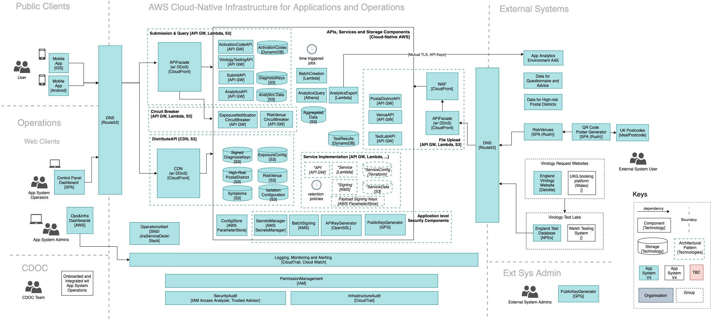
