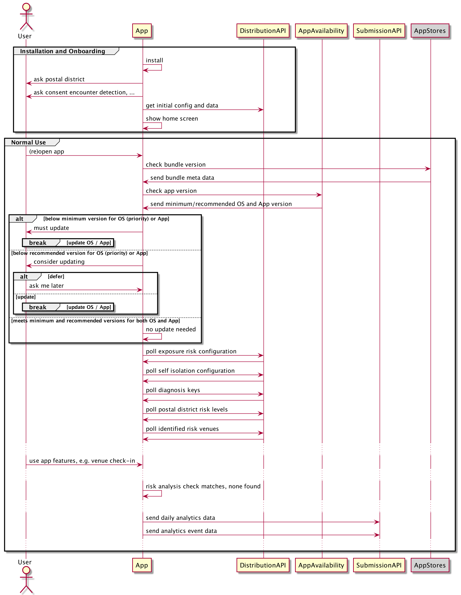
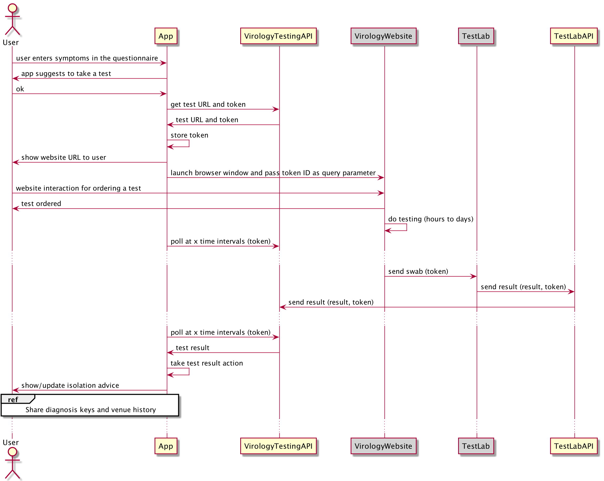
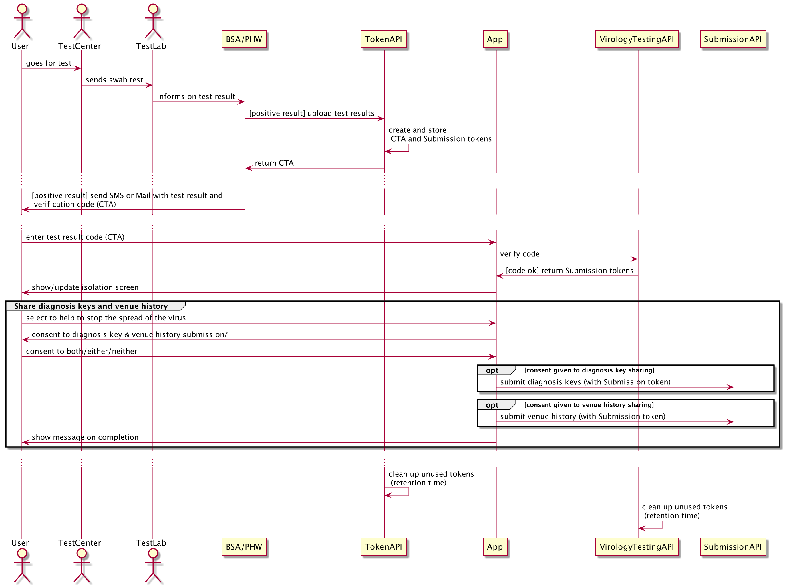

# Key User Journeys

System flows describe the behavioural interactions between the app, the backend services, the external systems and the monitoring and operation components. They **do not describe interactions within a single system component** like an app user interacting with only mobile app.

### Installation, configuration and normal use

This is the flow on first app install, and in normal use when the app is collecting exposures and QR code check-ins and checking these against distributed positive diagnosis keys, identified risk venues and high-risk postcodes.

On **first install and when the app is opened** after it has been closed completely on the mobile device, it checks version availability with our backend service as well as the Apple and Google app stores. This check then may notify the user of mandatory or optional available app updates. It also allows to deactivate all but the availability check functionality, hence acting as a kind of "kill switch".

After that it downloads and applies the following **configurations**:

* Exposure Configuration (Apple Google EN Framework) for encounter detection and exposure risk computation
* Self-Isolation Configuration for isolation time intervals

It then periodically downloads and uses data, retrieved from  **data distribution** APIs:

* Diagnosis Keys
* Postal District Risk Levels
* Identified Risk Venues
* Data and structure for the Symptoms Questionnaire

On a daily basis the app will submit anonymous **mobile analytics** data:

* Technical static data: OS and app version, and the device model
* Technical dynamic data such as cumulative bytes of data uploaded/downloaded and the number of completed background tasks
* App usage related data on
    * Onboarding
    * Venue Check-Ins
    * Symptoms Questionnaire
    * Test results
    * Isolation

In addition, the app will submit anonymous **mobile analytics events** data to enable AAE to determine the epidemiological effectiveness of encounter detection:
* [ExposureWindow](https://developers.google.com/android/exposure-notifications/exposure-notifications-api#exposurewindow) data

The analytics data is stored in the backend without any reference to the submitting device or app installation.

### Matching diagnosis keys trigger exposure notification

This is the flow when a diagnosis key match is found. A ‘Circuit Breaker’ is a backend service to control alert or notification decisions, so a scenario where a whole city is told to isolate can be identified and action taken before it occurs.

The **risk analysis** is performed by a collection of algorithms within the app, using all available data and the configuration retrieved from the backend. There is no personal data in the backend that are needed as part of the risk analysis.

If risk analysis results in an action trigger, this must be **confirmed with the Circuit Breaker** backend service. The API may need time to decide what action to take (as it needs to see what other app user actions are pending, and get human input) hence it never makes an immediate response. Rather it generates a short-lived token and returns this reference to the app for it to ask for updates. The app will periodically poll the server for a decision, driven by the backgrounding schedule of the app.

For the Isolation advice please note, that no identifiable user state is stored within the cloud services. When we have asked a user to take an action all record of this is held on the app.

### Symptoms questionnaire, booking a test and getting result using a temporary token

This is the flow that is taken when the app recommends to a user that they take a Virology test after having entered symptoms in the questionnaire.

When the user interacts with the symptoms questionnaire, the App has the latest symptoms configuration and a mapping from symptoms to advice which is then shown to the user. With the advice there is an option to order a test and a start of the isolation countdown. The countdown is not synchronised with the backend, so in case the device is wiped or lost, there is no means to recover the isolation state for that user.

The testing process involves ordering and registering tests through the UK  Virology Testing website, which is external to the App system. Note the flow step for actual Virology Testing is a horribly over-simplified view of a complex process outside of our system.

The app generates a short-lived **token to pass to the Virology Testing website** so that it can match the results that come back a few days later. This token is generated as unique by the Backend Service. The Backend service will store the token so that it can confirm the results that it is sent are valid.

The app will sporadically poll the Virology Testing API to see if the test result is available. If the test result is negative no further action is taken.

As per the flow for an Exposure Notification, when an app user is confirmed positive they are asked to submit their keys for inclusion in the diagnosis keys distribution set.

### Receive test result token via Mail or SMS and enter into app for diagnosis key submission

This is the flow where the App user manually enters a test result code, received via SMS or Mail from the citizen notification service: BSA for England and PHW for Wales.

The notification service uses an App System API to upload the test result **and** get a test result verification token. The token is then send via SMS/Mail to the citizen together with the result so she can verify the test result with the app and submit diagnosis keys for contact exposure notifications.

### Venue check in, matching identified risk venues and alert user

Venue Check in and notification is described in [venues.md](venues.md)

