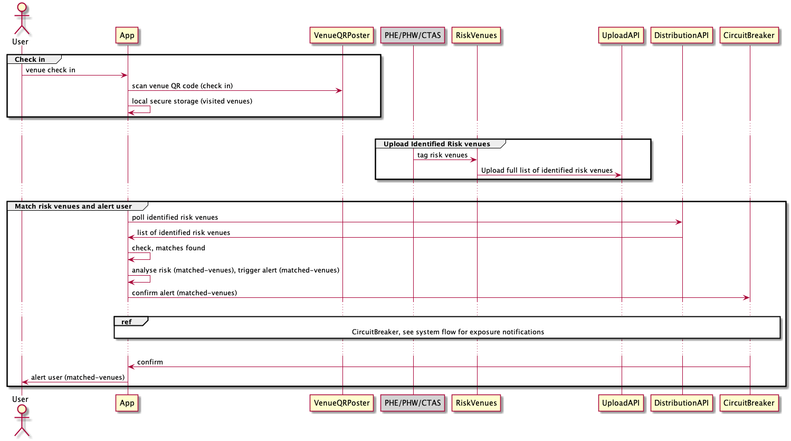

## Venue Posters, Check-In and Notifications

### Venue Posters

The Venue QR system allows a venue operator to create a poster for display in their premises. Some
venue types are required to create a poster and display it, while others may create a poster if they wish and are encouraged to do so.

The poster creation website lives at https://create-qr-code-poster.service.gov.uk. 

During this journey, minimal information
is collected from a venue operator allowing them to receive a PDF venue poster, any updates made to the poster, and enable health teams to contact them
if required.

>
>**Privacy of App users** is a key concern while developing this system. It makes no sense to take a privacy preserving EN system
and couple it to a venue system that allows tracking of individuals. This would disincentivise the download and active use of the
App, which has been significant in reducing chains of transmission of COVID-19.

### Venue Check-in

A user checks-in to a venue by scanning the QR Code on display in the premises. The App displays
the venue name and address, to allow the user to check that it is the right place, and the user confirms the
check-in.

The QR poster contains all the information displayed to the user.  There is no network activity required when a user checks-in
to a location, as this could potentially be used to track the user.

The data relating to the check-in stays on the mobile device, and is visible to the user in "Venue History".

### Venue Notifications

#### Collating information about venues with identified risk

The system receives information from an upstream system in which a number of data sources are combined to create a list of venues with identified risk that
should be communicated to user devices.

| API Name | API Group | API Contract | User/Client impact |
| --- | --- | --- | --- |
| Identified Risk Venues | [Upload](./api-patterns.md#upload) | [risky-venue-upload.md](api-contracts/service-facing/risky-venue-upload.md) | Data source for Risky Venue distribution API. |

In this regard, the Covid-19 app system acts only as a distributor of this information.

#### Determining if a user has visited a venue with identified risk

A list of venues with identified risk is made available on a Content Delivery Network (CDN).  This list contains venue IDs,
the date(s) and time(s) for which the venue is of interest, and information regarding the severity of warning that should be
presented to the user. 

As per the principles discussed in [the guidebook](guidebook.md), CDN access logging is disabled so the system operator has as little
information as possible regarding the users download the file. See [cloudfront_distribution_facade/main.tf](../../src/aws/libraries/cloudfront_distribution_facade/main.tf) for configuration
information relating to CloudFront.

The list of venues with identified risk is downloaded periodically by each device, and the venues compared with the venues that the user has checked-in to.
This comparison is performed on the device, so no information regarding the check-ins for a user leaves the device.

| API Name | API Group | API Contract | User/Client impact |
| --- | --- | --- | --- |
| Identified Risk Venues | [Distribution](./api-patterns.md#distribution) | [risky-venue-distribution.md](api-contracts/mobile-facing/distribution/risky-venue-distribution.md) | List of venues marked as risky which mobile clients poll for periodically. If the client has been in a risky venue within the risk period (defined in risky venue upload) a warning message is displayed. |

#### Determining whether to notify a user

Before alerting a user, the device checks the "Venue Circuit Breaker", which allows the system operators to quickly disable
the notifications functionality should there be a problem with the content of the list of venues with identified risk. The call to the circuit breaker
does not contain any venue identifiers.

As per the principles in the guidebook, API Gateway access logging is disabled for these calls. See [circuit_breaker_api_gateway/main.tf](../../src/aws/libraries/circuit_breaker_api_gateway/main.tf) for
configuration information relating to Circuit Breaker.

| API Name | API Group | API Contract | User/Client impact |
| --- | --- | --- | --- |
| Risk Venues Circuit Breaker | [Circuit Breaker](./api-patterns.md#circuit-breaker) | [risky-venue-circuit-breaker.md](api-contracts/mobile-facing/circuit-breaker/risky-venue-circuit-breaker.md) | Manual circuit breaker to stop exposure notification alerts in mobile clients after a venue is marked as risky from the upload API. |

### Interactions for Check-In and Notifications

