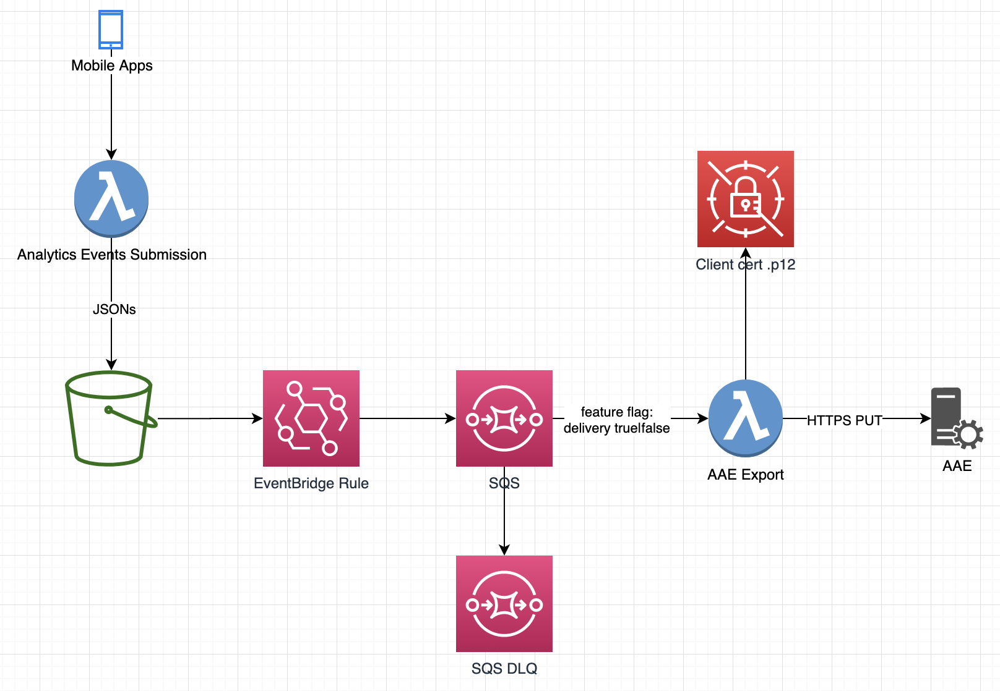

# AAE Export: Pattern "Decouple S3 Ingest and Export via SQS"



* Use EventBridge (& CloudTrail) to automatically add events to SQS after files are added to S3 (```aws_cloudwatch_event_rule``` and ```aws_cloudwatch_event_target```)
* Let a Lambda function automatically process these events (```aws_lambda_event_source_mapping```)
* Control retry behavior in Lambda by re-throwing (retry) or catching & logging (no retry) Java Exceptions 
* Control retry behavior by controlling the pause between export attempts (```aws_sqs_queue.visibility_timeout_seconds```) and the number of retries (```aws_sqs_queue.redrive_policy.maxReceiveCount```)
* Dead Letter Queue for files that cannot be exported (```aws_sqs_queue.redrive_policy.deadLetterTargetArn```)
* Target-environment-specific feature flag to enable/disable SQS message processing (e.g. ```aws_lambda_event_source_mapping.enabled = contains(var.enabled_workspaces, "*") || contains(var.enabled_workspaces, terraform.workspace) || contains(var.enabled_workspaces, "branch") && substr(terraform.workspace, 0, 3) != "te-"```). This allows us to pause export to AAE for up to 14 days without "losing" files added to S3
* FIXME: Monitoring: ```ApproximateNumberOfMessagesVisible > x``` must trigger an alert
