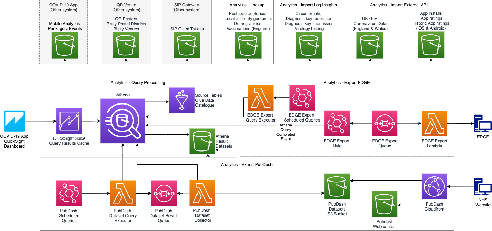

# Analytics Query Processing & Export

## Abstract
Dataset generation from SQL queries.

## Overview
In this composition, Athena is used to execute SQL queries, based on data from a variety of sources in S3.  The queries serve QuickSight Dashboards, and generated datasets for export to EDGE analytics and for PubDash, the dashboard on the public website for the COVID-19 App statistics.

## QuickSight Dashboards
The QuickSight dashboards are driven by Athena SQL queries.  The queries are based on various tables mapped to S3 buckets by a Glue Data Catalogue. 
The queries are cached in Spice and refreshed daily.

## EDGE Analytics
The datasets for export to EDGE are driven by Athena SQL queries, executed daily on a schedule.  The generated datasets are exported to an EDGE bucket by a dedicated export lambda, that consumes Athena query completion events via a queue.

## PubDash
The datasets for export to PubDash are driven by Athena SQL queries, executed daily on a schedule.  The generated datasets are polled for completion and transferred to a PubDash bucket, which is accessible, together with a bucket for the PubDash web artefacts, via CloudFront from the public website.

