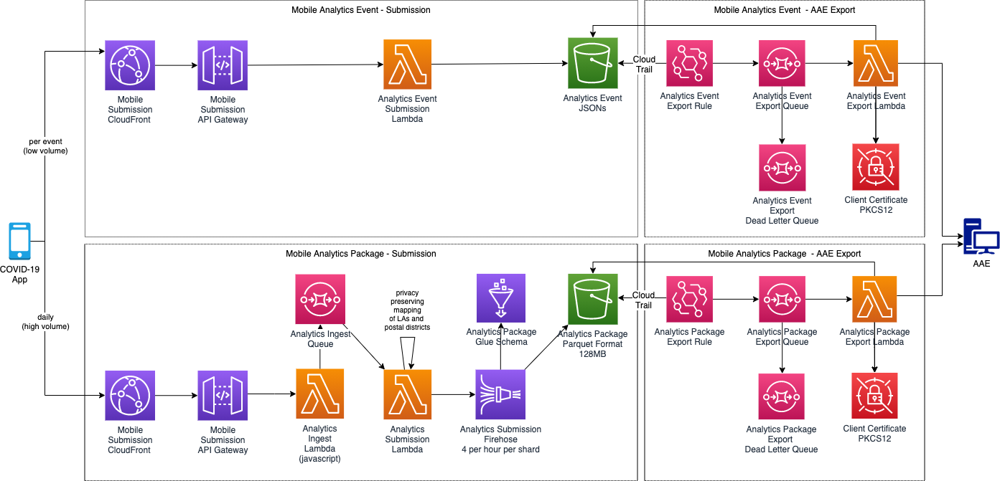

# Analytics Import and Export to AAE 

## Abstract
Data import and event-driven export.

## Overview
In this composition, mobile analytics packages and epidemiological events are imported and persisted.  As data is imported, an export to AAE is triggered - immediately for events, periodically for packages.



## API Contracts

[Mobile Analytics Event - Submission](../../architecture/api-contracts/mobile-facing/submission/analytics-event-submission.md)

[Mobile Analytics Package - Submission](../../architecture/api-contracts/mobile-facing/submission/analytics-submission.md)

[Mobile Analytics Event - AAE Export](../../architecture/api-contracts/service-facing/exporter/analytics-event-aae-exporter.md)

[Mobile Analytics Package - AAE Export](../../architecture/api-contracts/service-facing/exporter/analytics-aae-exporter.md)

## Import Flow
### Epidemiological event
The mobile App sends Epidemiological events, as they occur, one at a time.  These are relatively low volume.  A lambda is sufficient to persist the data unchanged to an S3 bucket.

### Analytics package
The mobile App sends an analytics package daily. This is spread over several hours. There is a sustained period of traffic in the early hours.  A minimal (javascript) lambda forwards requests to a queue to avoid any loss of packages from cold starts when rapidly scaling out. 

To preserve privacy, the lambda maps small LAs and Postal Districts into larger aggregates during import.  The mapping versioned and managed separately and bundled with the lambda - see [Privacy Filtering](../details/privacy-filtering.md).

Firehose is used to fill the S3 bucket, with each shard creating a new file, in parquet format, every 15 minutes.  The target parquet columns are defined by a glue schema.

## Export Flow
For exporting analytics packages and epidemiological events to AAE, the separate flows adopt the same mechanism:

- An EventBridge rule notifies SQS of the new json file stored in the relevant S3 bucket
- A new event is created in SQS which is delivered to the relevant AAE export lambda 
- The AAE export lambda processes the event, gets the corresponding json from S3, sends it to AAE and, on completion, removes the event from SQS 
- If there is a failure when processing the event, it will re-appear in SQS to be re-processed later 
- After a number of failed attempts, the event will be added to the dead letter queue (DLQ)

### Epidemiological event
Sent immediately.
### Analytics package
Sent every 10 minutes.

### Configuration 
* Use EventBridge (& CloudTrail) to automatically add events to SQS after files are added to S3 (```aws_cloudwatch_event_rule``` and ```aws_cloudwatch_event_target```)
* Let a Lambda function automatically process these events (```aws_lambda_event_source_mapping```)
* Control retry behavior in Lambda by re-throwing (retry) or catching & logging (no retry) Java Exceptions 
* Control retry behavior by controlling the pause between export attempts (```aws_sqs_queue.visibility_timeout_seconds```) and the number of retries (```aws_sqs_queue.redrive_policy.maxReceiveCount```)
* Dead Letter Queue for files that cannot be exported (```aws_sqs_queue.redrive_policy.deadLetterTargetArn```)
* Target-environment-specific feature flag to enable/disable SQS message processing (e.g. ```aws_lambda_event_source_mapping.enabled = contains(var.enabled_workspaces, "*") || contains(var.enabled_workspaces, terraform.workspace) || contains(var.enabled_workspaces, "branch") && substr(terraform.workspace, 0, 3) != "te-"```). This allows us to pause export to AAE for up to 14 days without "losing" files added to S3
* Alert is triggered when ```ApproximateNumberOfMessagesVisible > x```
