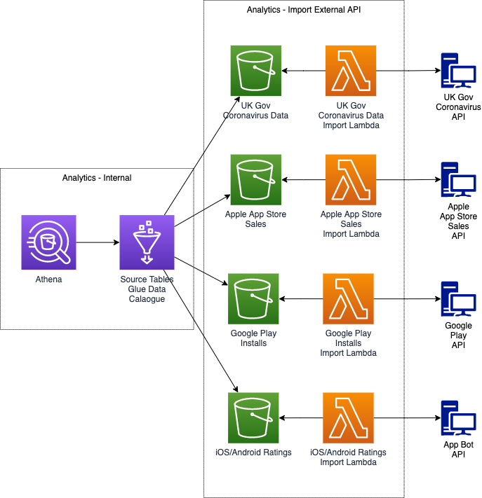

# Analytics Import from External APIs 

## Abstract
Import of data from external APIs.

## Overview
In this composition, data is downloaded from an external api by a dedicated import lambda and persisted in a corresponding S3 bucket.

## UK Government
- Coronavirus Data (England and Wales)

## Apple App Store
- App sales

## Google Play
- App installs

## App Bot
- iOS App ratings
- android App ratings

