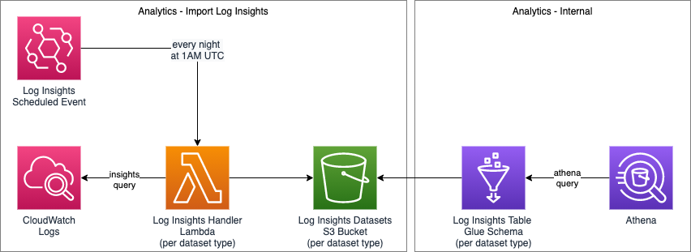

# Analytics Import Log Insights 

## Abstract
Periodic querying of logs for use in analytics.

## Overview
In this composition, a scheduled daily event triggers the execution of a pre-defined Log Insights query on CloudWatch logs.  The resulting dataset is stored in a corresponding S3 bucket for subsequent use by analytics.
The pattern is repeated for a number of different datasets targeting  cloudwatch logs for services related to virology.

## API Contracts
There are no external facing contracts

## Dataset Types
Every day at 1am UTC, an event triggers a lambda for each of the following `dataset types`:

* Virology test order and result upload & retrieval
    * `cta-token-gen`
    * `cta-exchange`
    * `cta-token-status`
* Exposure notification circuit breaker
   * `en-circuit-breaker`
* Diagnosis key submission
    * `diagnosis-keys-submission`
* Diagnosis key federation 
  * `federation-key-download`
  * `federation-key-upload`

## Time Window
There is an environment variable called `ABORT_OUTSIDE_TIME_WINDOW` which is set to true by default which will fail if you try to run the lambda outside of the time-window (1:00-1:10)

