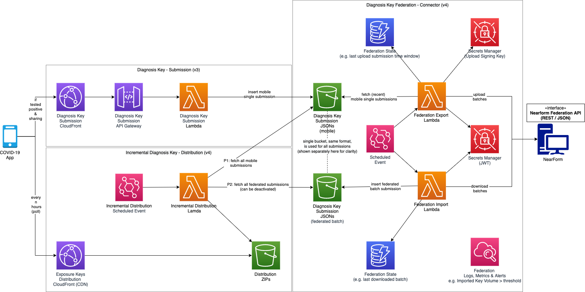
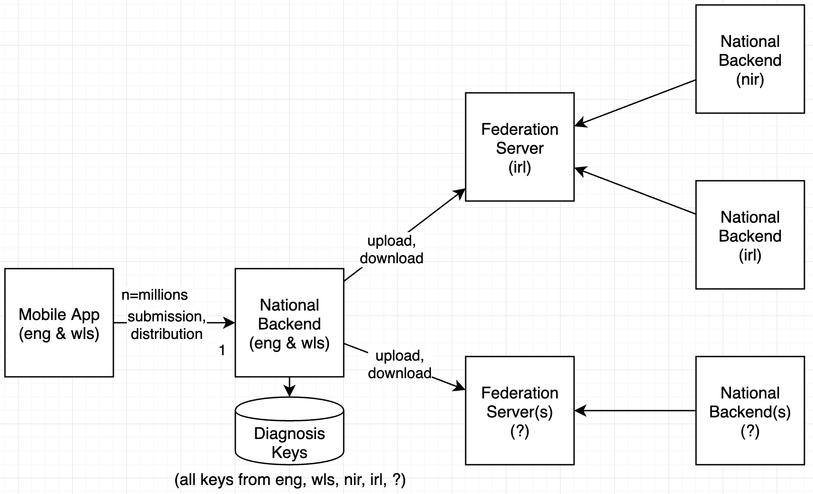

# Diagnosis Key Federation

## Abstract
Periodic data exchange via a third-party interface.

## Overview
In this composition, the COVID-19 App system uploads diagnosis keys submitted by Mobile App users and, at the same time, downloads diagnosis keys from federated regions.  This is done periodically, on a schedule.  The mobile App then polls for the latest distribution of diagnosis keys, which is made up of those submitted by App users plus those downloaded from the federated regions.

- Diagnosis key submission
  - App user, if tests positive, submits diagnosis keys
- Diagnosis key export
  - App backend uploads diagnosis keys submitted by the App to all federation servers
- Diagnosis key import
  - App backend downloads diagnosis keys from all federation servers
- Diagnosis key distribution
  - App backend distributes diagnosis keys (submitted by App user, downloaded from federation server) for Apps to pick up.
- Diagnosis key gateway (optional)
  - National backend acts as federation server gateway and uploads key batches downloaded from federation server A to federation server B (and vice versa)

> Note: The diagnosis key always contains the originating region

## API Contracts
[Diagnosis Key Submission](../../architecture/api-contracts/mobile-facing/submission/diagnosis-key-submission.md)

[Diagnosis Key Distribution](../../architecture/api-contracts/mobile-facing/distribution/diagnosis-key-distribution.md)

[Diagnosis Key Federation Connector](../../architecture/api-contracts/service-facing/connector/diagnosis-key-federation-connector.md)

### Configuration

- Integration components (import & export lambdas) can be instantiated more than once with different a configuration per instance, e.g.  import enabled/disabled, export enabled/disabled, gateway feature enabled/disabled
- All diagnosis key batches downloaded from federation servers will be stored as submissions in the existing submission bucket, using a different S3 object key prefix per federation server.  This allows the incremental distribution component to only require minimal adjustments, e.g. the configuration of disabled submission S3 object key prefixes

## Federation Overview

- Potentially millions of mobile app installations per national backend
- Potentially one-digit to two-digit number of national backends per federation server
- Federation servers may be interconnected (not shown)
- Each national backend stores all keys of all national backends that are directly or indirectly connected via federation servers
- National backend potentially connected to more than one federation server
- National backends can potentially serve as a gateway to exchange diagnostic keys between two connected federation servers

### Future

##### Diagnosis Key Federation within Europe

- Potentially three-digit number of national backends for large federation servers (e.g. European federation server)
- Each national backend stores all keys of all national backends that are directly or indirectly connected via federation servers
- Diagnosis Key region array contains region of national backend (origin) and also regions of interest of the app user that submitted the key
- Only diagnosis keys of interest (for the app user) are sent to the mobile application
