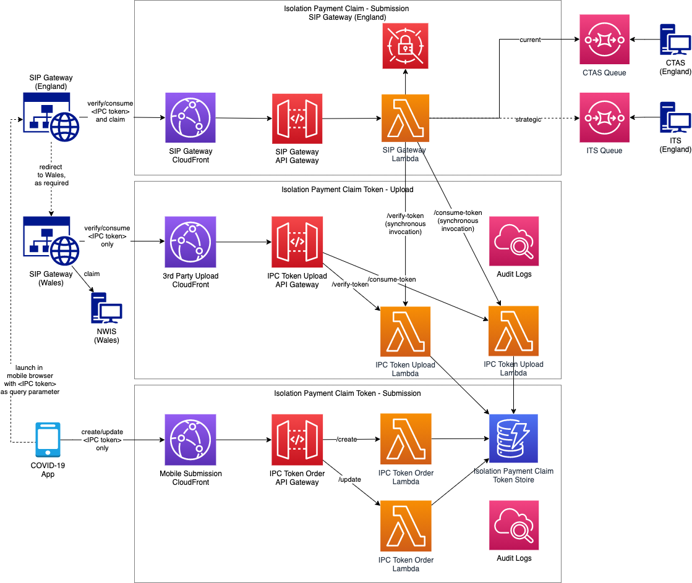

# Isolation Payment Claim

## Abstract
Managed handover to another system, using a transfer token.

## Overview
In this composition, an App user, while self-isolating, initiates a self-isolation payment claim and is handed off to the SIP gateway to verify and process the claim.
The SIP Gateway (England) redirects claims for users in Wales to the separate SIP Gateway (Wales) to verify and process the claim there.



## API Contracts

[Isolation Payment Claim Token - Submission](../../architecture/api-contracts/mobile-facing/submission/isolation-payment-claim-token-submission.md)

[Isolation Payment Claim Token - Upload](../../architecture/api-contracts/service-facing/upload/isolation-payment-claim-token-upload.md)

## Isolation Payment Claim Tokens

### States 
The states have a linear, one-way, flow. Only the current state is persisted:
- ```created```  
  - a new ```ipcToken``` has been created (secure random) when a user enters self isolation. The token is invalid until updated.
- ```valid```    
  - Additional data fields have been associated with the token by an update when the user initiates a claim. The token is now valid and can be consumed (once).
- ```(deleted)```      : 
  - The token is automatically deleted in the following situations
    - After expiry: 
      - Expiration date is initially set to ```14 days``` after creation.
      - Expiration date is updated to `Isolation Period End Date` as soon as the date is known.
    - After successful consumption

### Timestamps
Timestamps of state transitions are recorded against the token:
- createdTimestamp: 
  - timestamp for the ```/isolation-payment/ipc-token/create``` call
- updatedTimestamp
  - timestamp for the ```/isolation-payment/ipc-token/update``` call
- validatedTimestamp: 
  - timestamp for the last ```ipc-token-verify``` invocation

All timestamps (including expiration date) are in Unix epoch time format, in seconds.

### Audit
State transitions must be audit logged:
- CloudWatch Logs
- Information, including (amongst others)
  - ```ipcToken``` and triggering action

### Authentication/Authorization
The SIP Gateway (England) consumes token verification & consumption lambdas directly, so relevant access must be enabled, per environment.

AWS IAM (cross-account):
* Exposing account (COVID-19 App System) offers IAM Role to be assumed (via STS) by external account (SIP Gateway)
    * IAM policy: allow ```lambda:InvokeFunction``` for exposed API Lambda functions in [Isolation Payment Claim Token - Upload](../../architecture/api-contracts/service-facing/upload/isolation-payment-claim-token-upload.md)

      * Trust policy: allow ```sts:AssumeRole``` to external account
    * IAM Role managed on account level
* Both systems must agree on naming conventions (to decouple IAM Role & Policy creation with IaC)
    * In exposing account: ```arn:aws:iam::<account ID>:role/isolation-payment-gateway```


### References

- https://aws.amazon.com/de/premiumsupport/knowledge-center/lambda-function-assume-iam-role/
- https://docs.aws.amazon.com/amazondynamodb/latest/developerguide/time-to-live-ttl-before-you-start.html
