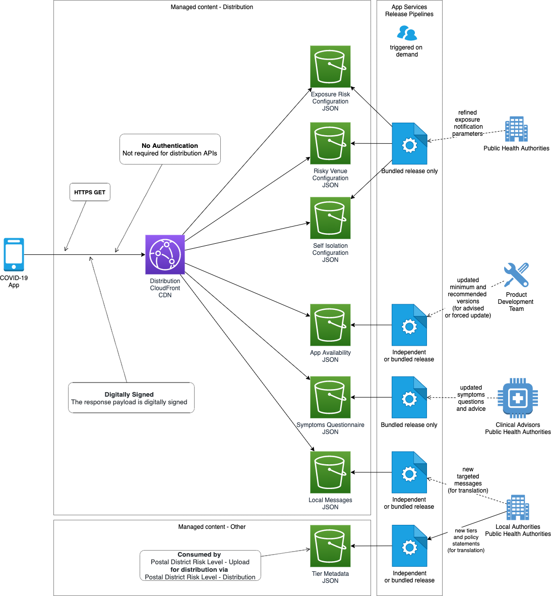

# Managed release for Distribution

## Abstract
Managed distribution of data, using a release pipeline.

## Overview
In this composition, a dataset for configuration or managed content, is uploaded by a release pipeline and digitally signed for distribution and consumption by the mobile App.
Some datasets have an independent maintenance lifecycle and are released separately.

## API Contracts
### Configuration
[Exposure Risk Configuration](../../architecture/api-contracts/mobile-facing/configuration/exposure-risk-configuration.md)

[Risky Venue Configuration](../../architecture/api-contracts/mobile-facing/configuration/risky-venue-configuration.md)

[Self Isolation Configuration](../../architecture/api-contracts/mobile-facing/configuration/self-isolation-configuration.md)

### Distribution
[App Availability Distribution](../../architecture/api-contracts/mobile-facing/distribution/app-availability-distribution.md)

[Local Messages Distribution](../../architecture/api-contracts/mobile-facing/distribution/local-messages-distribution.md)

[Symptoms Questionnaire Distribution](../../architecture/api-contracts/mobile-facing/distribution/symptoms-questionnaire-distribution.md)
