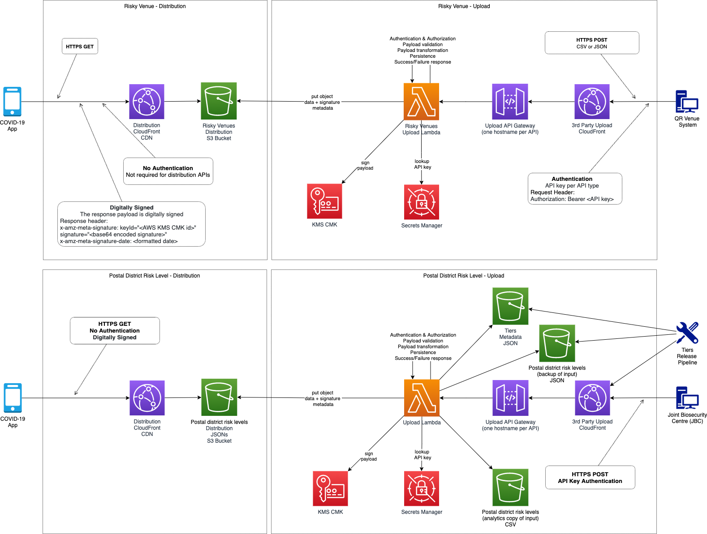

# Third-party Upload for Distribution

## Abstract
Upload of data by trusted third-parties, using API keys and data signing.

## Overview
In this composition, a dataset, such as postal district risk levels or risky venues, is uploaded by a trusted third-party and digitally signed for distribution and consumption by the mobile App.
The flow for postal district risk level upload has evolved further to accommodate the tiers themselves, and associated policy copy, changing over time.

## API Contracts
[Risky Venue - Upload ](../../architecture/api-contracts/service-facing/upload/risky-venue-upload.md)

[Postal District Risk Level - Upload](../../architecture/api-contracts/service-facing/upload/postal-district-risk-level-upload.md)

[Risky Venue - Distribution](../../architecture/api-contracts/mobile-facing/distribution/risky-venue-distribution.md) 

[Postal District Risk Level - Distribution](../../architecture/api-contracts/mobile-facing/distribution/postal-district-risk-level-distribution.md)
