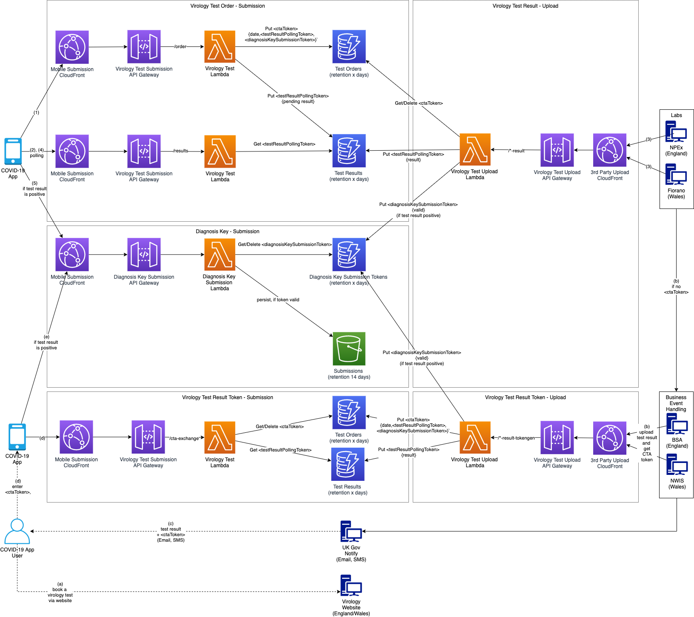

# Virology test ordering, results retrieval & diagnosis key sharing
## Abstract
Decoupled order and fulfillment, using tokens for correlating, sequencing, and right of access.

## Overview
In this composition, there are two main flows depending on whether the App user orders a virology test though the App or the public website.  

If the App user orders a test via the App, the App sends the order and then polls periodically in the background for a result.  When the lab later uploads the test result, the test result is retrieved by the App, and the result acted upon accordingly.  

If the App user orders a test via the website the App knows nothing about it.  When the lab later processes the result, it delegates to the business services to upload the result and generate a test order token, which is sent with the result to the user by email/sms.  The user enters the generated test order token into the App, the test result is retrieved, and the result acted on accordingly. 

In both cases, the App user, if tested positive and consenting to share, submits their diagnosis keys.

## API Contracts

### Test ordered via the App
[Virology Test Order - Submission](../../architecture/api-contracts/mobile-facing/submission/virology-test-order-submission.md) 

[Virology Test Result - Upload](../../architecture/api-contracts/service-facing/upload/virology-test-result-upload.md) 

### Test ordered via the website
[Virology Test Result Token - Upload](../../architecture/api-contracts/service-facing/upload/virology-test-result-token-upload.md)

[Virology Test Result Token - Submission](../../architecture/api-contracts/mobile-facing/submission/virology-test-result-token-submission.md)

### Diagnosis key submission
[Diagnosis Key - Submission](../../architecture/api-contracts/mobile-facing/submission/diagnosis-key-submission.md)
