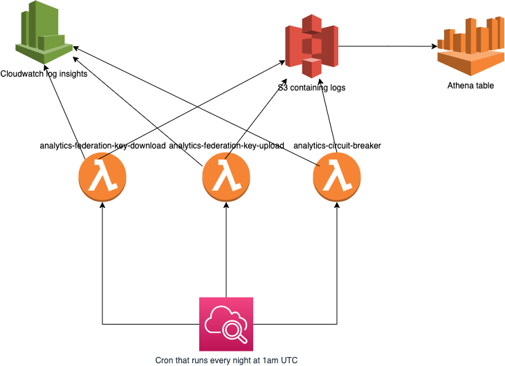

# Analytics Logs

## Overview

Every day at 1am UTC, a cron job runs the following lambdas:
* <environment>-analytics-federation-key-download
* <environment>-analytics-federation-key-upload
* <environment>-analytics-circuit-breaker

There is an environment variable called `ABORT_OUTSIDE_TIME_WINDOW` which is set to true by default which will fail if you try to run the lambda outside of the time-window (1:00-1:10)

These lambdas make a request to cloudwatch using pre-defined queries within their lambdas:

### analytics-federation-key-download
This lambda gets the:
* Download statistics: number of downloaded keys per time period per origin (i.e. all keys)
* Download statistics: number of imported keys by test type per time period per origin (i.e. only valid keys)

### analytics-federation-key-upload
This lambda gets the:
* Upload statistics: number of uploaded keys by test type per time period

### analytics-circuit-breaker
This lambda gets the:
* Circuit Breaker Stats (of the last day) via CloudWatch Logs Insights Query (e.g. circuit breaker calls from iOS/android per hour)

Once these lambdas have got the statistics they requested, they will construct a json and upload it to its linked S3 bucket, such as:
* <environment>-analytics-federation-key-download -> <environment>-analytics-federation-key-proc-download
* <environment>-analytics-federation-key-upload -> <environment>-analytics-federation-key-proc-upload
* <environment>-analytics-circuit-breaker -> <environment>-analytics-circuit-breaker

Once the jsons are in the bucket, they will be picked up by Athena and inserted into their linked table in the analytics db

