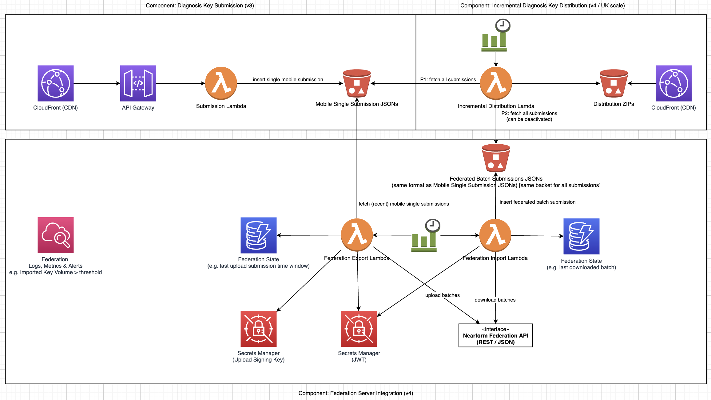

# V4: Diagnosis Key Federation within ~UK

## Federation Overview

- One national backend and potentially millions of mobile app installations per national backend
- Potentially one-digit to two-digit number of national backends per federation server
- Federation servers that may be interconnected (not shown in the figure)
- Each national backend stores all keys of all national backends that are directly or indirectly connected via federation servers
- National backend potentially connected to more than one federation server
- National backends can potentially serve as a gateway to exchange diagnostic keys between two connected federation servers

## Federation Server Integration

- Diagnosis key export (federation server batch upload API): National backend uploads diagnosis keys submitted by the national mobile app to all federation servers
- Diagnosis key import (federation server batch download API): National backend downloads diagnosis keys from all federation servers
- National backend distributes all diagnosis keys (submitted via mobile, downloaded from federation server) to all mobile application installations
- Optional: National backend acts as federation server gateway and uploads key batches downloaded from federation server A to federation server B (and vice versa)
- Region of diagnosis key contains always the region of the national backend

### Details

- Integration components (Export Lambda & Import Lambda) can be instantiated more than once (different configuration per instance, e.g. gateway feature enabled/disabled, import enabled/disabled, export enabled/disabled)
- All diagnosis key batches downloaded from federation servers will be stored as submissions in the existing submission bucket (different s3 objekt key prefix per federation server) so that the incremental distribution component only needs minimal adjustments, e.g. configuration of disabled (federation server-) submission s3 object key prefixes

# Post V4: Diagnosis Key Federation within Europe

- Potentially three-digit number of national backends for large federation servers (e.g. European federation server)
- Each national backend stores all keys of all national backends that are directly or indirectly connected via federation servers
- Diagnosis Key region array contains region of national backend (origin) and also regions of interest of the app user which did submit the key
- Only diagnosis keys of interest (for the app user) are sent to the mobile application
