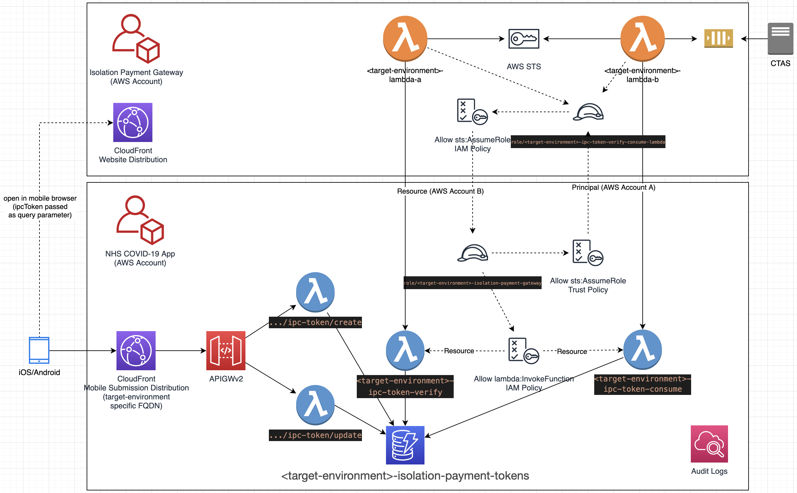

# Isolation Payment

## Overview



## HTTP API

Mobile-facing submission: see [HTTP API contract](../architecture/api-contracts/isolation-payment-mobile.md)

## Lambda API 

Lambda functions directly exposed to the SIP Gateway external system in a different AWS account (synchronous invocation): see [Lambda API contract](../architecture/api-contracts/isolation-payment-gateway.md)

### Authentication/Authorization

AWS IAM (Cross account):
* Exposing account: AWS account of the "NHS COVIS-19 App" (dev, prod, staging)
* External account: AWS account of the "SIP - Isolation Payment Gateway" (dev, prod, staging)
* Exposing account offers IAM Role to be assumed (via STS) by external account (dev to dev, staging to staging, prod to prod)
    * IAM policy: allow ```lambda:InvokeFunction``` for exposed API Lambda functions in [Lambda API contract](../architecture/api-contracts/isolation-payment-gateway.md)
    * Trust policy: allow ```sts:AssumeRole``` to external account
    * IAM Role managed on account level
* Both systems must agree on naming conventions (to decouple IAM Role & Policy creation with IaC)
    * In exposing AWS Account: ```arn:aws:iam::<account ID>:role/isolation-payment-gateway```

## Isolation Payment Claim Tokens

States (linear flow - only current state must be persisted):
- (not existing)
- ```created```  : New ```ipcToken``` created (generated from secure random source, >= 32 bytes, hex representation). Token is invalid.
- ```valid```    : Additional data fields associated with the token (stored in the token item in DynamoDB). Token is valid and can be consumed (once).
- (deleted)      : Token is automatically deleted in these cases:
- - (DynamoDB TTL / expiration date): Expiration date is initially set to ```14 days``` after creation. Expiration date is set to  Isolation Period End Date as soon as the date is known.
  - Token is immediately deleted after successful consumption

Timestamp of state transitions are stored in individual columns of the token item in DynamoDB:
- createdTimestamp: Timestamp of the ```/isolation-payment/ipc-token/create``` call
- updatedTimestamp: Timestamp of the ```/isolation-payment/ipc-token/update``` call
- validatedTimestamp: Timestamp of the last ```<target-environment>-ipc-token-verify``` invocation
- All timestamps (including expiration date) are stored in Unix epoch time format in seconds (same format as the TTL column)

State transitions must be audit logged:
- CloudWatch Logs
- Information (amongst others): ```ipcToken``` and triggering action

## References

- https://aws.amazon.com/de/premiumsupport/knowledge-center/lambda-function-assume-iam-role/
- https://docs.aws.amazon.com/amazondynamodb/latest/developerguide/time-to-live-ttl-before-you-start.html
