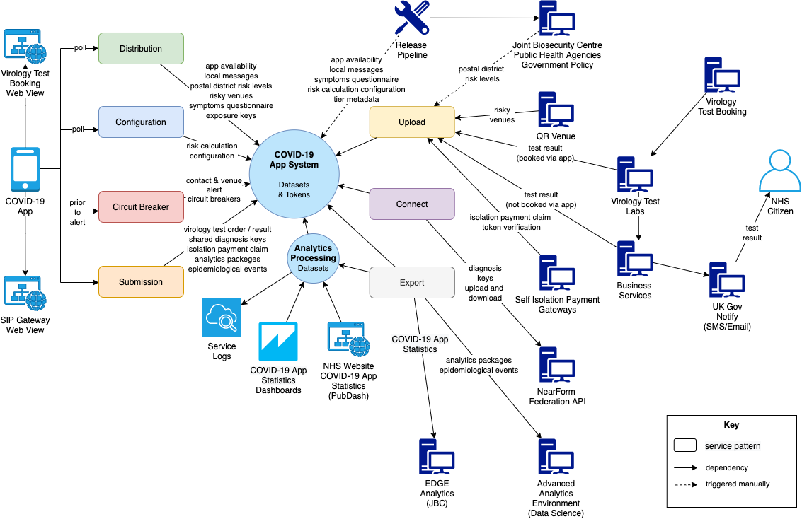
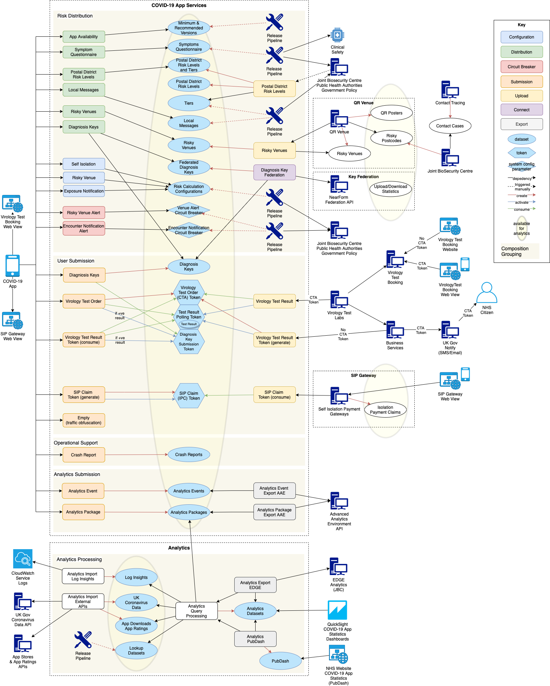

# Design of services 

## Overview

Services have common [foundations](../architecture/api-foundation.md) that set out the principles for API design, including serverless and stateless operation, consistent endpoints, network [security](../architecture/api-security.md), and the use of HTTP headers and status codes for authentication, digital signing and service resilience.
APIs are specified by example, using semi-formal [contracts](../architecture/api-contracts/README.md). 
API contracts with similar interactions are grouped into [patterns](../architecture/api-patterns.md)
for collective reasoning and handling.

The landscape of interactions,  grouped by pattern, is as follows:

> For more details, see:
>- [API Foundations](../architecture/api-foundation.md) 
> - [API Security](../architecture/api-security.md)
> - [API Patterns](../architecture/api-patterns.md)
> - [API Contracts](../architecture/api-contracts/README.md)

## Compositions
Sets of [API contracts](../architecture/api-contracts/README.md) used in conjunction with one another form a *composition*.  Whilst patterns indicate the type of interaction, compositions provide a wider functional context that is useful for understanding the different aspects of the system.  

The following compositions are described:
- Risk distribution & configuration
  - [Releases for distribution](compositions/release-for-distribution.md)
  - [Third-party upload for distribution](compositions/upload-for-distribution.md)
  - [Diagnosis key sharing for distribution](compositions/diagnosis-key-federation.md)
- User submission
    - [Virology test order, results retrieval & diagnosis key share](compositions/virology-test-order-result-keyshare.md)
    - [Isolation payment claim](compositions/isolation-payment-claim.md)
- Analytics submission & processing
  - [Analytics import from mobile and export to AAE](compositions/analytics-import-export-aae.md)
  - [Analytics import from external apis](compositions/analytics-import-external.md)
  - [Analytics import from log insights](compositions/analytics-import-log-insights.md)
  - [Analytics query processing for QuickSight and export to EDGE and PubDash](compositions/analytics-export-query.md)
- Operational support
    - [Mobile crash report](compositions/crash-report-submission.md)
  
The full landscape of interactions, highlighting the patterns and compositions, is as follows:

