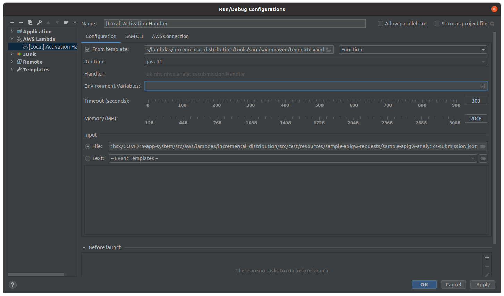

# SAM - Serverless Application Model

https://aws.amazon.com/serverless/sam/

# What are we using this for

You can use SAM to run a lambda locally inside a Docker container. This allows us to look at:

- Startup time 
- Memory Settings
- Classloading
- Logging Configurations

# Setting JVM Parameters

You can set a JVM parameter in the `template.yaml` - JAVA_TOOL_OPTIONS

# Running inside IntelliJ

### Install Plugin 

Install the IDEA Plugin -> "AWS Toolkit"

### Add Run Configuration

Add AWS Lambda Run Configuration - you'll need to reference the SAM Template - there is one for building the Java Lambdas,
and a sample API request. This needs to be a JSON file that looks as if it is coming from the source system - so in the case of most of 
our lambdas, an API Gateway Proxy Request. There is an example one called `sample-apigw-analytics-submission.json`

