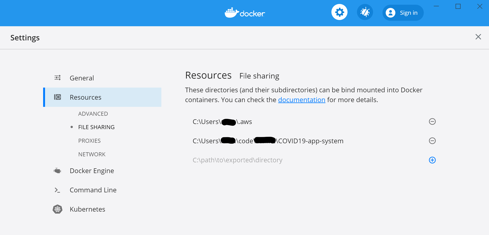

# Dockerized development environment

## Purpose

The dockerized development environment is a container, created via a Dockerfile, that contains all the tools required for building, deploying and testing the COVID-19 App System locally.

## Usage notes
The root of your cloned repository is mapped into `/workspace` within the container, and your `~/.aws` folder to `/root/.aws` within the container.

Changes made to files/folders anywhere else in the container's filespace are not
persisted when the container is exited.

The build tasks, used for setup, detect AWS credentials and automatically configure them in the container. They also mount the correct volumes in the container.

If the credentials file, created with ```aws configure```, is not found, the AWS_ACCESS_KEY_ID and AWS_SECRET_ACCESS_KEY environment variables are used.

The AWS profile used can be controlled with the AWS_PROFILE environment variable.


## Setup

The [build system](../../../doc/BUILDSYSTEM.md) must first be provisioned, as described in the [environment pre-requisites](PROVISION_PREREQS.md).

Then, from the root of the repository, run the following convenience tasks:

Pull the docker container image

```bash
rake provision:devenv:pull
```

Run the docker image

```bash
rake devenv
```

## Notes for Docker for Windows

- In order to be able to start Docker, make sure you have [Hyper-V enabled](https://docs.microsoft.com/en-us/virtualization/hyper-v-on-windows/quick-start/enable-hyper-v) and running.
In case you use Intel HAXM for virtualization (i.e. Android Virtual Devices use Intel HAXM), when Hyper-V is running, Intel HAXM is not able to start a virtual device, so Hyper-V needs to be turned off and the machine restarted.

- If you get an error running `rake devenv` stating _"Filesharing has been cancelled"_, open Docker for Windows and navigate to **Settings** > **Resources** > **File Sharing**. Add the path to  `C:\Users\<USERNAME>\.aws` and path to this source code on your workstation (See [Docker file sharing](https://docs.docker.com/docker-for-windows/#file-sharing))


